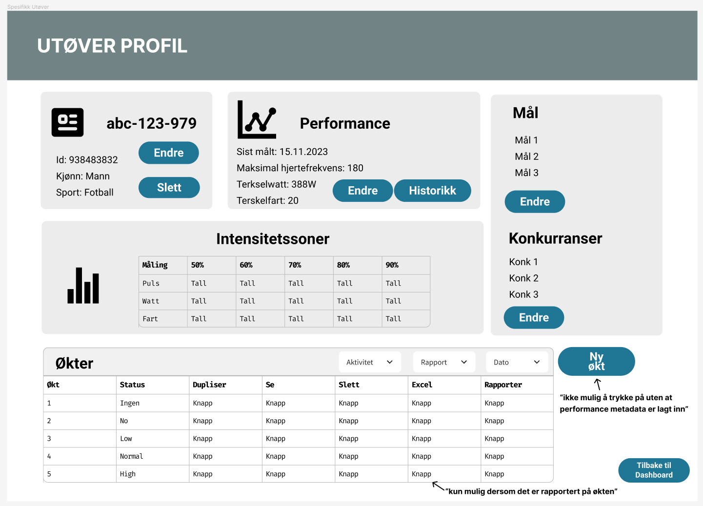
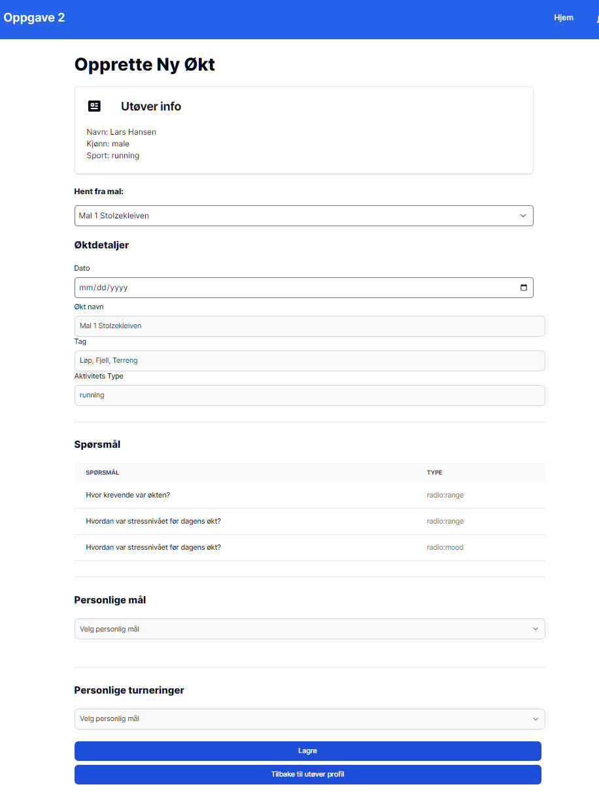

## DASHBOARD
#### URL: "/"
#### Design skisse:

#### Levert Løsning:

#### APIer

- `/api/athletes/` - GET
- `/api/activities/` - GET

#### Funksjonalitet:

- Knapp "Hjem"
  - > URL: "/" (rerender siden)
    (denne gjelder alle sider siden den ligger i navbar og vil ikke bli beskrevet flere 
  ganger).
- Knapp "ICON: bjelle"
  - > Modal: Økter som har pasert dagens dato, men er ikke rapoortert på.
  (denne gjelder alle sider siden den ligger i navbar og vil ikke bli beskrevet flere ganger).
- Knapp "Ny treningsmal"
  - > URL: "/new_template"
- Knapp "Nye spørsmål"
  - > URL: "/new_questions"
- Knapp "Ny utøver"
  - > URL: "/new_athlete"
- Søkeboks "Søk etter en utøver"
  - > Filterer listen med utøvere basert på hva som skrives i tekst boks
- Tabell med utøvere (hvis ingen utøvere vises det tekst "ingen utøvere opprettet")
  - > Kolloner: Navn på Utøvere (sortert på UUID), knapp økter, knapp rapporer
- Knapp "ICON: øye"
  - > URL: "/athlete/[userId]" (Utøver Profil for den valgte utøveren)
- Tabell med økter (hvis ingen økter opprettet vises det tekst "ingen økter opprettet")
  - > Kolloner: Økt navn (sortert på UUID), dato, knapp se, knapp rapporte 
- Knapp "ICON: øye"
  - > URL: "/workout/[workoutId]" (Økt Detaljer for den valgte økten)
- Knapp "ICON: clipboard"
  - > URL: "/status/[workoutId]" (Økt Rapportering for den valgte økten)
    
## Opprette ny treningsmal
#### URL: "/new_template"
#### Design skisse:

#### Levert Løsning:

#### APIer

- `/api/templates/` - POST
- `/api/sports/` - GET
- `/api/templatequestions` - GET

#### Funksjonalitet:

- Input boks: "Økt navn"
  - > Holder på string for økt navn
- Input boks: "Tags"
  - > Holder på string som blir sendt til api komma seperert
  dersom ikke kommer er satt opp, basert på space mellom hver tag og satt i en liste []
- Input boks: "Slug"
  - > Holder på en string som blir auto generert basert på input i "Økt Navn" bruker lodash
- Dropdown: "Sport"
  - > Velger en sport som ligger på api punktet /api/sports
- Input boks: "Antall spørsmål": number
  - > Ved å sette inn ett tall her vil knappen "Hente Spørsmål dukke opp"
  - Knapp: "Hente Spørsmål"
    - > Når det er satt inn ett tall i "Antall spørsmål" så vil denne dukke opp den henter
    random X antall spørsmål ifra api punktet /api/templatequestions som er spørsmål opprettet
    i /new_questions og lister det ut under i tabellen. Bruker API funksjonen
- Tabell: "Spørsmål"
  - > Kolonner: Spørsmålstekst / type
- Knapp: "Legg til spørsmål"
  - > Viser frem en boks for input av spørsmål
    - > Input boks: "Spørsmålstekst" holder på en string, spørsmålstegn blir lagt på automatisk 
    hvis ikke brukeren skriver ett spørsmålstegn på slutten avstringen som skrives i denne boksen
    - > Dropdown boks: "Type Spørsmål" Viser til dem 3 typene spørsmål som finnes som Types. radio:mood,
    radio:range og text. 
    - > Knapp "Legg til spørmsål" Hvis det er skrevet noe i "Spørsmålstekst" boksen så vil ved å trykke
    på denne knappen bli lagt til listen over spørsmål 
- Tickboxes: "Sett Måleparameter"
  - > 4 varianter; oppleved intensitet, watt, hastighet, puls 
  Minst en av disse må være haket av før at Økt intervaller skal vises (og Opprete mal kanppen vises)
  - Tabell: "Økter"
    - > Kolloner: Intervall (index + 1) / Varighet (number) / Intensitets Sone (dropdown)
    Dropdown intensistets sone velger mellom 1 = 50%, 2 = 60%, 3 = 70%, 4 = 80%, 5 = 90% eller velg sone (-1).
  - Knapp: "Legg til intervall"
    - > Lager en ny rad i tabellen med nye input bokser.
- Knapp: "Slett"
  - > Tømmer skjema
- Knapp: "Opprette Mal" (vises kun hvis alt er fylt ut)
  - > Sjekker at alle påkrevde input felter er utfylt. 
  - > Dersom ikke OK så kommer det en: Toast notification i Sør-Østlig del av vinduet som gir en feilmelding. 
  - > Dersom OK så kommer det en: Toast notification i Sør-Østlig del av vinduet som gir en grønn melding om at 
  malen er lagret og tømmer skjemaet. Og bruker POST api funksjonen
- Knapp: "Tilbake til dashboard"
  - > URL. "/"

## Registere ny utøver
#### URL: "/new_athlete"
#### Design skisse:

#### Levert Løsning:

#### APIer

- `/api/athletes` - POST
- `/api/sports/` - GET

#### Funksjonalitet:

- Input boks: "Navn"
  - > Holder på string for utøverens navn
  - > Hvis det blir lagt inn feks navn + etternavn så erstattes mellomrommet med "-" slik at 
  slipper %20 i URL på Utøverprofil osv
- Dropdown: "Kjønn"
  - > Valg mellom 3 typer kjønn male/woman/other vises på norsk i frontend, sendes som string
- Dropdown: "Sport"
  - > Velger en sport som ligger på api punktet /api/sports
- Knapp: "Legg til utøver"
  - > Kaller API funksjonen 
  - > Hvis OK gir toast notification ok med at utøver er opprettet
  - > Hvis bruker finnes ifra før av (HTTP:409) gir toast notification error med at utøver finnes
  ifra før av (navn)
  - > Hvis ikke OK (alle felter ikke fylt ut eller annen feil) gir toast notificaiton error
- Knapp: "Tilbake til dashboard"
  - > URL. "/"

## Registere nye spørsmål
#### URL: "/new_questions"
#### Design skisse:

#### Levert Løsning:

#### APIer

- `/api/templatequestions` - GET
- `/api/templatequestions` - POST

#### Funksjonalitet:

- Input boks: "Spørsmålstekst"
  - > holder på en string, spørsmålstegn blir lagt på automatisk
  hvis ikke brukeren skriver ett spørsmålstegn på slutten avstringen som skrives i denne boksen
- Dropdown boks: "Type Spørsmål"
  - > Viser til dem 3 typene spørsmål som finnes som Types. radio:mood, radio:range og text.
- Knapp: "Legg til"
  - > Kaller API post funksjonen
  - > Hvis spørsmåltekst er fylt ut og OK så gir den en toast notification sucsess
  - > Hvis spørsmålteskt ikke er fylt ut eller API feil gir den en toast error.

## Utøver Profil
#### URL: "/athlete/[userId]"
#### Design skisse:

#### Levert Løsning:

#### APIer

- `/api/athletes/${userId}` - GET
- `/api/athletes/${userId}` - PATCH
- `/api/athletes/${userId}` - DELETE
- `/api/athletes/${userId}/intensityzones` - GET
- `/api/athletes/${userId}/metadata` - POST
- `/api/athletes/${userId}/metadata` - GET
- `/api/athletes/${userId}/metadata/newest` - GET
- `/api/athletes/${userId}/activities` - GET
- `/api/activities/${workoutId}/duplicate` - POST
- `/api/activities/${workoutId}` - DELETE
- `/api/sports` - GET

#### Funksjonalitet:

- Card: "Utøver info"
  - > "Navn" viser user.userId fra api kallet og bytter ut "-" med " " dersom det 
  er i user.userId
  - > "Kjønn" viser user.gender fra api kallet (her kunne vi satt opp en tabell)
  i databasen som viste norsk tekst og dette kunne vises i frontend, vi valgte
  å gå for denne løsningen fordi at da kan man endre i databasen hva kjønn som 
  er lovlig å velge uten å endre alt på frontend
  - > "Sport" viser user.sport fra api kallet (samme årsak til over for at det står
  på engelsk)
  - > Knapp: "Endre"
    - > bruker PATCH api funksjonen som endrer kjønn og/eller sport til en utøver
  -> Knapp: "Slett"
    - > bruker DELETE api funksjonen som sletter brukeren, det kommer
    en bekreftelses boks opp når denne trykkes på.

- Card: "Mål og konkurranser"
  - > Knapp: "Se treningsmål"
    - > URL: "/new_goal/[userId]"
  - > Knapp: "Se konkurranser"
    - > URL: "/new_tournament/[userId]"

- Card: "Utøver prestasjon"
  - > Hvis ingen lagt inn vil det vises en knapp for å legge til data
  - > Viser hvis det er lagt inn nyeste data (basert på når det ble lagt inn nye data)
  - > "Sist målt: viser dato for sist målt.
  - > "Maksimal hjertefrekvens": viser number for heartrate
  - > "Terkselwatt": viser number for watt
  - > "Terskelfart": viser number for hastighet
  - > Knapp "Endre"
    - > Når trykket på kommer det opp 3 input bokser for å sette nye data
    når det blir trykket lagre så legges det i tabellen UserExtendedMeta med Date 
    på når det ble oppdatert, cardet vil oppdatere seg basert på at det som endres til 
    har da en nyere dato
  - > Knapp "Historikk"
    - > Når trykket på så viser den ett nytt card under utøver prestasjon
    som gir en tabell på når dataene var endret og med dem 3 verdiene
- Card: "Intensitetssoner"
  - > Tabell:
    - > Kolloner: Måling / 50% / 60% / 70% / 80% / 90%
    - > Måling: hvilken type måling det er
    - > 50%: 0.5 * Puls/Watt/Hastighet prestasjonsdata
    - > 60%: 0.5 * Puls/Watt/Hastighet prestasjonsdata
    - > 70%: 0.5 * Puls/Watt/Hastighet prestasjonsdata
    - > 80%: 0.5 * Puls/Watt/Hastighet prestasjonsdata
    - > 90%: 0.5 * Puls/Watt/Hastighet prestasjonsdata
- Card: "Økter"
  - > Knapp: "Evaluering"
    - > URL: "/evaulation/[userId]"
  - > Tabell: Økter
    - > Filter: "Aktivitet"
      - > Filterer på sport, bruker api/sports
    - > Filter: "Rapoort"
      - > Filterer på rapporterings status undefined/no/low/normal/high
    - > Input: "Dato"
      - > Filterer på dato på økten
    - > Kollonner: Økt navn / status / se / dupliser / excel / rapporter/endre / slett
      - > Økt navn: viser navnet på økten som er opprettet
      - > Status: viser om det er gjort en rapporterings status på økten
      - > ICON: øye: 
        - > URL "/workout/[workoutID]/"
      - > ICON: kopi fil:
        - > kaller api/activities/${workoutId}/duplicate post og oppdaterer tabellen.
        Setter status "ingen"/undefined på den kopierte økten
      - > ICON: excel:
        - > Kan kun trykkes på dersom det er en status på økten annet enn ingen
        - > kjører funksjonen "/utils/generateExcel.tsx" som laster ned 
        ett excel ark med inneholdet til userActivity
      - > ICON: clipboard:
        - > URL "/status/[workoutID]/"
      - > ICON: søppelbøtte:
        - > kaller /api/activities/${workoutId} delete og oppdaterer tabellen
    - > Knapp: "Ny økt"
      - > URL: "/new_workout/[userId]"

## Opprette nytt treningsmål
#### URL: "/new_goal/[workoutId]"
#### Design skisse:

#### Levert Løsning:

#### APIer

- `/api/athletes/${userId}` - GET
- `/api/athletes/${userId}/goals/` - GET
- `/api/goals` - POST

#### Funksjonalitet:

- Card: "Utøver info"
  - > "Navn" viser user.userId fra api kallet og bytter ut "-" med " " dersom det
    er i user.userId
  - > "Kjønn" viser user.gender fra api kallet (her kunne vi satt opp en tabell)
    i databasen som viste norsk tekst og dette kunne vises i frontend, vi valgte
    å gå for denne løsningen fordi at da kan man endre i databasen hva kjønn som
    er lovlig å velge uten å endre alt på frontend
  - > "Sport" viser user.sport fra api kallet (samme årsak til over for at det står
    på engelsk)
- Input: "Navn"
  - > Holder på en string som navn for treningsmålet
- Input: "Dato"
  - > Kan velge en dato for treningsmålet
- Input: "Mål"
  - > Hodler på ett number
- Input: "Kommentar"
  - > Holder på en string for kommentar (valgfri)
- Knapp: "Legg til treningsmål"
  - > Kaller /api/goals POST funksjonen, sjekker om alle påkrevde
  felter er fylt ut og gir en TOAST suksess hvis OK og TOAST error 
  hvis ikke ok. Og oppdaterer tabellen. Og tømmer skjema.
- Tabell: "Treningsmål"
  - > Kolloner: Navn / Mål / Dato / Kommentar
    - > Navn: navnet på treningsmålet
    - > Mål: måltallet
    - > Dato: viser dato på "norsk" måte
    - > Kommentar: viser kommentar på målet
- Knapp: "Tilbake til utøver profil"
  - > URL: "/athlete/[userId]"

## Opprette ny konkurranse
#### URL: "/new_tournament/[workoutId]"
#### Design skisse:

#### Levert Løsning:

#### APIer

- `/api/athletes/${userId}` - GET
- `/api/athletes/${userId}/tournaments/` - GET
- `/api/tournaments` - POST

#### Funksjonalitet:

- Card: "Utøver info"
  - > "Navn" viser user.userId fra api kallet og bytter ut "-" med " " dersom det
    er i user.userId
  - > "Kjønn" viser user.gender fra api kallet (her kunne vi satt opp en tabell)
    i databasen som viste norsk tekst og dette kunne vises i frontend, vi valgte
    å gå for denne løsningen fordi at da kan man endre i databasen hva kjønn som
    er lovlig å velge uten å endre alt på frontend
  - > "Sport" viser user.sport fra api kallet (samme årsak til over for at det står
    på engelsk)
- Input: "Navn"
  - > Holder på en string som navn for konkurransen
- Input: "Dato"
  - > Kan velge en dato for konkurransen
- Input: "Sted"
  - > Holder på en string som location for konkurransen
- Input: "Mål"
  - > Hodler på en string som fritekst mål for konkurransen
- Dropdown: "Sport"
  - > Velger en sport som ligger på api punktet /api/sports
- Tickbox: "Prioritet"
  - > Bruker kan kun velge en tick box om gangen sender 1/2/3 inn til api punktet
- Input: "Kommentar"
  - > Holder på en string for kommentar (valgfri)
- Knapp: "Legg til konkurrase"
  - > Kaller /api/tournaments POST funksjonen, sjekker om alle påkrevde
    felter er fylt ut og gir en TOAST suksess hvis OK og TOAST error
    hvis ikke ok. Og oppdaterer tabellen. Og tømmer skjema.
    Hvis HTTP: 409 så kommer det toast melding om at konkurranse med samme prioritet alle ligger på 
    utøveren da det er krav om at det kan kun være en av hver prioritet (A/B/C)(så maks 3 konkurranser)
- Tabell: "Konkurranser"
  - > Kolloner: Navn / Dato / Sted / Mål / Sport / Pri / Kommentar
    - > Navn: navnet på konkurransen
    - > Dato: viser dato på "norsk" måte
    - > Sted: viser location for konkurransen
    - > Mål: mål fritekst
    - > Sport: viser sport
    - > Prioritet: viser til brukeren 1=A, 2=B, 3=C
    - > Kommentar: viser kommentar på målet
- Knapp: "Tilbake til utøver profil"
  - > URL: "/athlete/[userId]"

## Økt detaljer
#### URL: "/workout/[workoutId]"
#### Design skisse:

#### Levert Løsning:

#### APIer

- `/api/activities/${workoutId}/reports` - GET
- `/api/activities/${workoutData.goalId}/intervals` - GET
- `/api/intervals/${item.id` - PATCH

#### Funksjonalitet:

- Card: "Utøver info"
  - > "Navn" viser user.userId fra api kallet og bytter ut "-" med " " dersom det
    er i user.userId
  - > "Kjønn" viser user.gender fra api kallet (her kunne vi satt opp en tabell)
    i databasen som viste norsk tekst og dette kunne vises i frontend, vi valgte
    å gå for denne løsningen fordi at da kan man endre i databasen hva kjønn som
    er lovlig å velge uten å endre alt på frontend
  - > "Sport" viser user.sport fra api kallet (samme årsak til over for at det står
    på engelsk)
- Knapp: "Tilbake til utøver profil"
  - > URL: "/athlete/[userId]"
- Card: "Intervals"
  - > Hvilket intervall man er på f.eks. 1/4
  - > Intervall # (det det intervallet man er )
  - > Varighet: number på minutter for intervallet
  - > Sone: number på hvilken intervall sone man har for økten 5=90%
  - > Måleparameter (basert på hva som er målt på økten)
    - > Tabell: "Opplved intensitet"
      - > Kolloner: Min / Maks / Snitt
        - > Tall for verdiene min / maks snitt
    - > Tabell: (fortsetter her for så mange måleparameteren man har)
  - > Knapp: "Neste"
    - > Blar videre til neste intervall (dersom det er flere enn 1)
  - > Knapp: "Tilbake"
    - > Blar tilbake til forgje intervall (dersom man er på f.eks. intervall 2)

## Økt Rapportering 
#### URL: "/status/[workoutId]"
#### Design skisse:

#### Levert Løsning:

#### APIer

- `/api/activities/${workoutId}/reports` - GET
- `/api/reports` - POST
- `/api/activities/${workoutData.goalId}/intervals` - GET
- `/api/intervals/${item.id}` - PATCH
- `/api/activities/${workoutId}/questions` - GET
- `/api/questions/${questionId}` - PATCH

#### Funksjonalitet:

- Knapp: "Tilbake til økt"
  - > URL: "/workout/[workoutId]"
- Knapp: "Tilbake til utøver"
  - > URL: "/athlete/[userId]"
- Card: "1. Sett status på økten"
  - > Dropdown: Velg status / No / Low / Normal / High
    - > sender til tabell activityReport i lowecaps
- Card: "2. Intervals"
  - > Hvilket intervall man er på f.eks. 1/4
  - > Intervall # (det det intervallet man er )
  - > Varighet: number på minutter for intervallet
  - > Sone: number på hvilken intervall sone man har for økten 5=90%
  - > Måleparameter (basert på hva som er målt på økten)
    - > Tabell: "Opplved intensitet"
      - > Kolloner: Min / Maks / Snitt
        - > Tall for verdiene min / maks snitt
    - > Tabell: (fortsetter her for så mange måleparameteren man har)
  - > Knapp: "Neste"
    - > Blar videre til neste intervall (dersom det er flere enn 1)
  - > Knapp: "Tilbake"
    - > Blar tilbake til forgje intervall (dersom man er på f.eks. intervall 2)
  - > Knapp: "Lagre"
    - > kaller /api/intervals/${item.id} PATCH funksjonen med oppdaterte verdier.
- Card: "3. Svar på spørsmål fra økten"
  - > Hvilket spørsmål man er på f.eks. 1/3
  - > Spørsmål #
    - > Spørsmåls teksten
    - > Spørsmål variant (range 1-10 / radio mood (3 forskjellige emojier)
    Tekst (fritekst))
  - > Knapp: "Lagre"
    - > Kaller /api/questions/${questionsId } PATCH funksjonen
  - > Knapp: "Neste"
    - > Blar videre til neste intervall (dersom det er flere enn 1)
  - > Knapp: "Tilbake"
    - > Blar tilbake til forgje intervall (dersom man er på f.eks. intervall 2)
- Card: "4. Sett kommentar på økten"
  - > Input: "Kommentar til økten"
    - > Holder på en strin som blir sendt når man trykker på knappen nedenfor
- Knapp: "Lagre rapport"
  - > Kaller funksjonen /api/reports POST funksjonen og gir toast notification
  om suksesfult eller feilmelding om ikke.

## Opprette ny økt
#### URL: "/new_workout/[userId]"
#### Design skisse:

#### Levert Løsning:

#### APIer

- `/api/athletes/${userId}` - GET

#### Funksjonalitet:

- Card: "Utøver info"
  - > "Navn" viser user.userId fra api kallet og bytter ut "-" med " " dersom det
    er i user.userId
  - > "Kjønn" viser user.gender fra api kallet (her kunne vi satt opp en tabell)
    i databasen som viste norsk tekst og dette kunne vises i frontend, vi valgte
    å gå for denne løsningen fordi at da kan man endre i databasen hva kjønn som
    er lovlig å velge uten å endre alt på frontend
  - > "Sport" viser user.sport fra api kallet (samme årsak til over for at det står
    på engelsk)
- Knapp: "Hente"
  - > Viser NewWorkoutByTemplate component
- Knapp: "Lag Ny"
  - > Viser WorkoutDetails component
- Knapp: "Tilbake til utøver profil"
  - > URL: "/athlete/[userId]"

## Opprette ny økt fra Mal
#### URL: "/new_workout/[userId]"
#### Design skisse:

#### Levert Løsning:

#### APIer

- `/api/athletes/${userId}` - GET
- `/api/templates/` - GET
- `/api/activities` - POST
- `/api/athletes/${userId}/goals/` - GET
- `/api/athletes/${userId}/tournaments` - GET

#### Funksjonalitet:

- Card: "Utøver info"
  - > "Navn" viser user.userId fra api kallet og bytter ut "-" med " " dersom det
    er i user.userId
  - > "Kjønn" viser user.gender fra api kallet (her kunne vi satt opp en tabell)
    i databasen som viste norsk tekst og dette kunne vises i frontend, vi valgte
    å gå for denne løsningen fordi at da kan man endre i databasen hva kjønn som
    er lovlig å velge uten å endre alt på frontend
  - > "Sport" viser user.sport fra api kallet (samme årsak til over for at det står
    på engelsk)
- Øktdetaljer:
  - Dropdown: "Hent fra mal"
    - > Bruker /api/templates GET til å hente og liste ut alle treningsmalene som er laget
  - Input: "Dato"
    - > Kan velge en dato for treningsøkten
  - Input: "Økt Navn"
    - > Fylles med string verdien for navnet på malen
  - Input: "Tag"
    - > Fylles med tags ifra malen
  - Input: "Aktivets Type"
    - > Fylles med sport typen fra malen
- Spørsmål:
  - > Tabell: Kolloner: Spørsmål / Type
    - > Spørsmål: string ifra malen med spørsmålstekst
    - > Type: string med typet verdi (3 varianter)
- Personlige mål:
  - > Dropdown: som bruker /api/athletes/${userId}/goals/ GET funksjonen og fyller dropdownen 
- Personlige turneringer:
  - > Dropdown: som bruker /api/athletes/${userId}/goals/ GET funksjonen og fyller dropdownen
- Knapp: "Lagre"
  - > Kaller /api/activities POST funksjonen med data som er i valgt. gir toast dersom suksessfult
  og toast dersom ikke suksessfult med melding.
- Knapp: "Tilbake til utøver profil"
  - > URL: "/athlete/[userId]"

## Opprette ny økt fra Scratch
#### URL: "/new_workout/[userId]"
#### Design skisse:

#### Levert Løsning:

#### APIer

- `/api/athletes/${userId}` - GET
- `/api/templates/` - GET
- `/api/sports/` - GET
- `/api/activities` - POST
- `/api/athletes/${userId}/goals/` - GET
- `/api/athletes/${userId}/tournaments` - GET

#### Funksjonalitet:

- Card: "Utøver info"
  - > "Navn" viser user.userId fra api kallet og bytter ut "-" med " " dersom det
    er i user.userId
  - > "Kjønn" viser user.gender fra api kallet (her kunne vi satt opp en tabell)
    i databasen som viste norsk tekst og dette kunne vises i frontend, vi valgte
    å gå for denne løsningen fordi at da kan man endre i databasen hva kjønn som
    er lovlig å velge uten å endre alt på frontend
  - > "Sport" viser user.sport fra api kallet (samme årsak til over for at det står
    på engelsk)
- Øktdetaljer:
  - Input: "Dato"
    - > Kan velge en dato for treningsøkten
  - Input: "Økt Navn"
    - > String verdien for navnet på økten
  - Input: "Tag"
    - > String med tags
  - Dropdown: "Sport"
    - > Kaller /api/sports/ GET funksjonen og fyller dropdownen
- Tickboxes: "Sett Måleparameter"
  - > 4 varianter; oppleved intensitet, watt, hastighet, puls
    Minst en av disse må være haket av før at Økt intervaller skal vises (og Opprete mal kanppen vises)
  - Tabell: "Økter"
    - > Kolloner: Intervall (index + 1) / Varighet (number) / Intensitets Sone (dropdown)
      Dropdown intensistets sone velger mellom 1 = 50%, 2 = 60%, 3 = 70%, 4 = 80%, 5 = 90% eller velg sone (-1).
  - Knapp: "Legg til intervall"
    - > Lager en ny rad i tabellen med nye input bokser.
- Legg til Spørsmål
  - > Input boks: "Spørsmålstekst" holder på en string, spørsmålstegn blir lagt på automatisk
  hvis ikke brukeren skriver ett spørsmålstegn på slutten avstringen som skrives i denne boksen
  - > Dropdown boks: "Type Spørsmål" Viser til dem 3 typene spørsmål som finnes som Types. radio:mood,
    radio:range og text.
  - > Knapp "Legg til spørmsål" Hvis det er skrevet noe i "Spørsmålstekst" boksen så vil ved å trykke
    på denne knappen bli lagt til listen over spørsmål
- Tabell Spørsmål
  - > Kollonner: Spørsmål / Type
    - > Her vil spørsmål tekst og type legges inn
- Personlige mål:
  - > Dropdown: som bruker /api/athletes/${userId}/goals/ GET funksjonen og fyller dropdownen
- Personlige turneringer:
  - > Dropdown: som bruker /api/athletes/${userId}/goals/ GET funksjonen og fyller dropdownen
- Knapp: "Lagre"
  - > Kaller /api/activities POST funksjonen med data som er i valgt. gir toast dersom suksessfult
    og toast dersom ikke suksessfult med melding.
- Knapp: "Tilbake til utøver profil"
  - > URL: "/athlete/[userId]"

## Evaluering
#### URL: "/evaluation/[userId]"
#### Design skisse:

#### Levert Løsning:

#### APIer

- `/api/templates/user/${userId}` - GET
- `/api/activities/${userId}/${selectedTemplate}` - GET
- `/api/analysis/${userId}/${selectedTemplate}` - POST
- `/api/analysis/${userId}/${selectedTemplate}/aggregate/grouped` - POST

#### Funksjonalitet:

- Evaluering
  - > "Navn" viser user.userId fra api kallet og bytter ut "-" med " " dersom det
    er i user.userId
- Dropdown: "Mal"
  - > Viser Maler som en utøver har opprettet økter med
- Tabell
  - > Kollone: Tickbox for å velge hvilke treningsøkter man ønsker å gjøre analyse på
  - > Kollone: Økt nr på øktene
  - > Kollone: Navn navn på økten
  - > Kollone: Rapporterte Intervaller viser hvor mange av økt intervallene det er gjort rapportering på
- Knapp: "Analyser"
  - > Viser Analysis component
- Knapp: "Tilbake til utøver profil"
  - > URL: "/athlete/[userId]"

## Analyse
#### URL: "/evaluation/[userId]"
#### Design skisse:

#### Levert Løsning:

#### APIer

- `/api/templates/user/${userId}` - GET
- `/api/activities/${userId}/${selectedTemplate}` - GET
- `/api/analysis/${userId}/${selectedTemplate}` - POST
- `/api/analysis/${userId}/${selectedTemplate}/aggregate/grouped` - POST

#### Funksjonalitet:

- Evaluering
  - > "Navn" viser user.userId fra api kallet og bytter ut "-" med " " dersom det
    er i user.userId
- Dropdown: "Mal"
  - > Viser Maler som en utøver har opprettet økter med
- Tabell
  - > Kollone: Tickbox for å velge hvilke treningsøkter man ønsker å gjøre analyse på
  - > Kollone: Økt nr på øktene
  - > Kollone: Navn navn på økten
  - > Kollone: Rapporterte Intervaller viser hvor mange av økt intervallene det er gjort rapportering på
- Knapp: "Analyser"
  - > Viser Analysis component
- Card: "Analyse"
  - > Tickboxes: "Sett Måleparameter"
    - > 4 varianter; oppleved intensitet, watt, hastighet, puls
    Minst en av disse må være haket av for at analysen skal vises 
  - > Tabell:
    - > Kollone: Økt viser øktene intervallene nedover i cellen kommer navnet på økten
    - > Kollone: Interval X Viser X antall intervaller med hva måleparametere det skal vises
    - > Rad: Snitt viser snittet på dem valgte måleparameterne på tvers av alle øktene
- Knapp: "Tilbake til utøver profil"
  - > URL: "/athlete/[userId]"