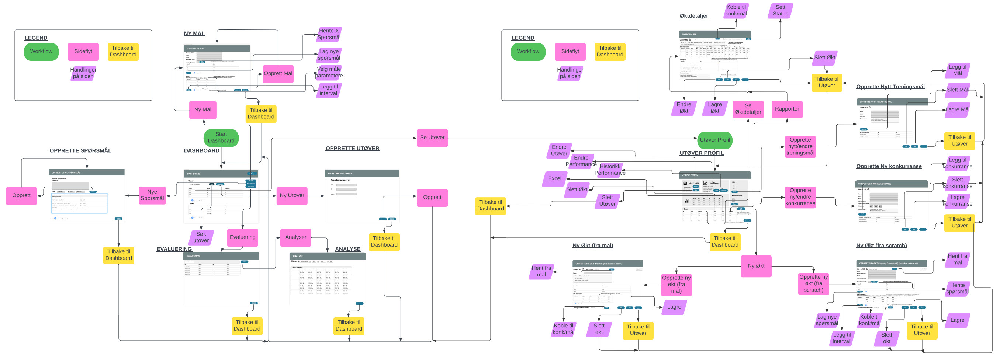
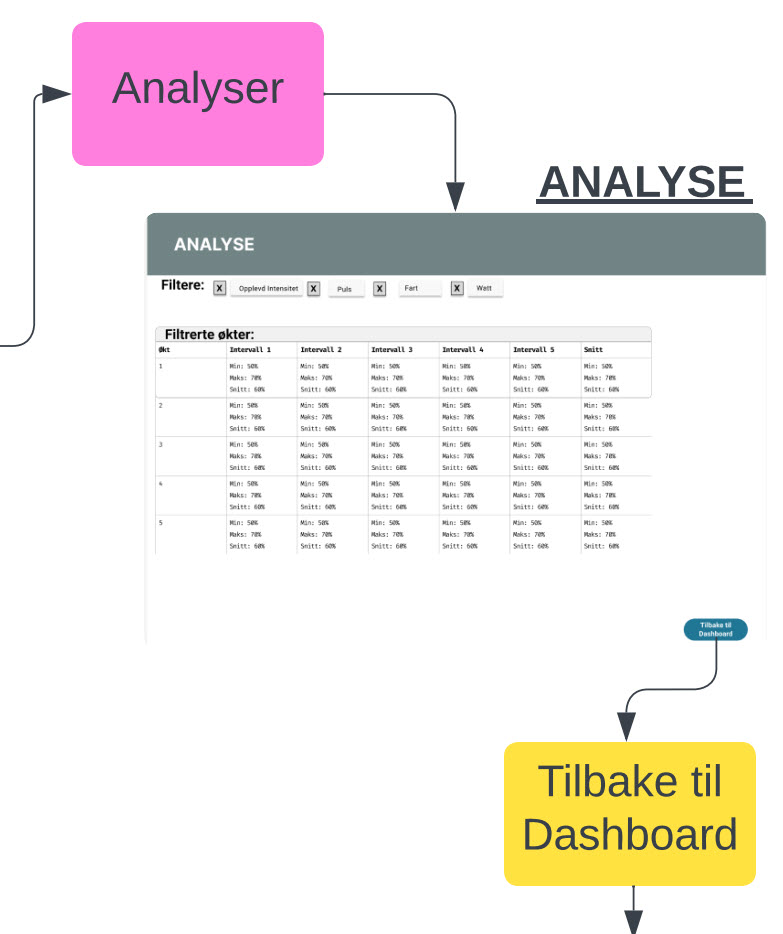
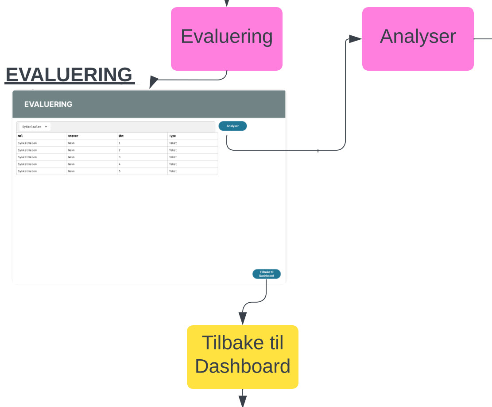
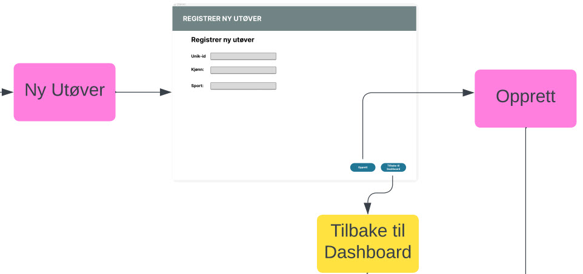
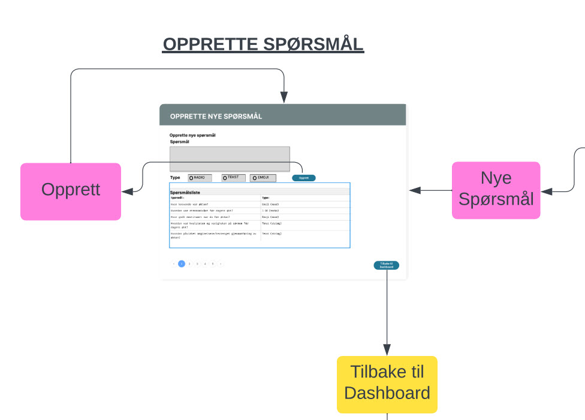
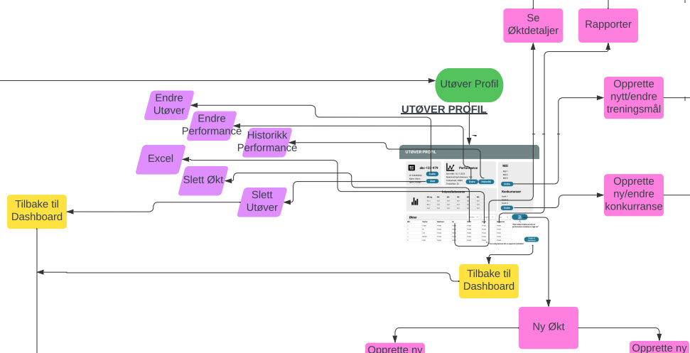
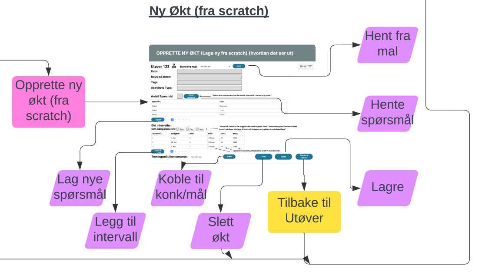

# API Dokumentasjon
Dette er en dokumentasjon av API endepunktene som blir utnyttet i Oppgave_2.

# Innholdsfortegnelse
1. [API Dokumentasjon](#api-dokumentasjon)  
   1.1 [Vanlige error koder](#vanlige-error-koder)  
2. [Athlete (model: User)](#athlete-model-user)  
   2.1 [/api/athlete](#apiathlete)  
      2.1.1 [GET](#get)  
      2.1.2 [POST](#post)  
   2.2 [/api/athlete/[id]](#apiathleteid)  
      2.2.1 [GET](#get-1)  
      2.2.2 [PATCH](#patch)  
      2.2.3 [DELETE](#delete)  
3. [Meta Data (model: Meta_Extended)](#meta-data-model-meta_extended)  
   3.1 [/api/metaData/[userId]](#apimetadatauserid)  
      3.1.1 [GET](#get-2)  
      3.1.2 [POST](#post-1)  
   3.2 [/api/metaData/find-one/[userId]](#apimetadatafind-oneuserid)  
      3.2.1 [GET](#get-3)  
4. [TemplateQuestion (model: templateQuestion)](#templatequestion-model-templatequestion)  
   4.1 [/api/templatequestions](#apitemplatequestions)  
      4.1.1 [GET](#get-4)  
      4.1.2 [POST](#post-2)  
   4.2 [/api/template-question/[id]](#apitemplate-questionid)  
      4.2.1 [DELETE](#delete-1)  
5. [Treningsmål (model: personalGoal)](#treningsmål-model-personalgoal)  
   5.1 [/api/personalGoal](#apipersonalgoal)  
      5.1.1 [POST](#post-3)  
   5.2 [/api/personalGoal/[userId]](#apipersonalgoaluserid)  
      5.2.1 [GET](#get-5)  
   5.3 [/api/personalGoal/[goalId]](#apipersonalgoalgoalid)  
      5.3.1 [DELETE](#delete-2)  
6. [Konkurranser (model: Tournament)](#konkurranser-model-tournament)  
   6.1 [/api/tournament](#apitournament)  
      6.1.1 [POST](#post-4)  
   6.2 [/api/tournament/[userId]](#apitournamentuserid)  
      6.2.1 [GET](#get-6)  
   6.3 [/api/tournament/[tournamentId]](#apitournamenttournamentid)  
      6.3.1 [DELETE](#delete-3)  
7. [Mal (model: Template)](#mal-model-template)  
   7.1 [/api/template/](#apitemplate)  
      7.1.1 [GET](#get-7)  
      7.1.2 [POST](#post-5)  
8. [Økt (model: userActivity)](#økt-model-useractivity)  
   8.1 [/api/workout](#apiworkout)  
      8.1.1 [POST](#post-6)  
   8.2 [/api/workout/[userId]](#apiworkoutuserid)  
      8.2.1 [GET](#get-8)  
   8.3 [/api/workout/[workoutId]](#apiworkoutworkoutid)  
      8.3.1 [GET](#get-9)  
      8.3.2 [DELETE](#delete-4)  
9. [Spørsmål (model: UserActivityQuestions)](#spørsmål-model-useractivityquestions)  
   9.1 [/api/queston/[workoutId]](#apiquestonworkoutid)  
      9.1.1 [GET](#get-10)  
   9.2 [/api/queston/[questionId]](#apiquestonquestionid)  
      9.2.1 [PATCH](#patch-1)
10. [Flowchart](#flowchart)
    10.1  [Hele Flowchartet](#hele-flowchartet)
    10.2  [Legend](#legend)
    10.3  [Dashboard](#dashboard)
    10.4  [Analyse](#analyse-(analysis))
    10.5  [Evaluering](#evaluering-(evaluation))
    10.6  [Opprette ny Utøver](#opprette-ny-utøver-(new_athelete))
    10.7  [Opprette nye spørsmål](#opprette-nye-spørsmål-(new_questions))
    10.8  [Opprette ny Mal](#opprette-ny-mal-(new_template))
    10.9  [Utøver Profil](#utøver-profil-(athlete/[userId]))
    10.10 [Økt Detaljer](#økt-detaljer-(workout/[userId]))
    10.11 [Opprette ny Økt](#opprette-ny-økt-(new_workout/[userId]))
    10.12 [Opprette ny konkurranse](#opprette-ny-konkurranse-(new_tournament/[userId]))
    10.13 [Opprette nytt treningsmål](#opprette-nytt-treningsmål-(new_goal/[userId]))

## Vanlige error koder 
For å unngå gjentakende skriving av vanlige error koder, inkluderer vi dem her:
- **400 Bad Request:**  
Hvis påkrevde felter mangler eller ikke er med i den tabellen. Påkrevde felter vil være synlige i dokumentasjonen for hver GET og POST endepunkt.
- **404 Not Found:**  
Hvis `[db tabell]` eller `[ressurs id]` ikke ble funnet.
- **500 Internal Server Error:**  
Hvis det skjedde en feil i prossessen av forespørselen. Dette er en veldig generisk feilmelding, og feilen ligger på serversiden.

## Athlete (model: User)
#### Akseptansekrav for Athlete
- Skal være mulig å opprette en ny utøver
- Skal være mulig å hente alle utøvere
- Skal være mulig å hente ut data om en spesifikk utøver
- Skal være mulig å endre data om en spesifikk utøver
- Skal være mulig å slette en spesifikk utøver.

### /api/athlete
Inneholder GET og POST metoder.

#### GET
> Henter ut en liste [] av alle utøvere i fra databasen

**Request Body**:  
Tar inn Query-parameter `page=antall` for pagination  
**Response Body**
- Status code 200 OK: Gir resultat av utøvere på den pagen, antall pages, hvilken page man er på, og hvor mange utøvere det er totalt.
- Status code 204 No Content: Hvis det ikke finnes noen utøvere, vil det returnere en tom liste.
- [Se Vanlige error koder](#vanlige-error-koder) `400, 404, 500`

#### POST
> Lagrer en ny utøver i databasen

**Request Body:**  
JSON payload (`unik id: string`, `kjønn: string`, `sport: string`)  
**Response Body:** 
- Status code 201 Created: Hvis forespørselen er vellykket. Returnerer data som ble lagt inn.
- [Se Vanlige error koder](#vanlige-error-koder) `400, 404, 500`

### /api/athlete/[id]
Inneholder GET, PATCH og DELETE metoder.

#### GET
> Henter ut informasjon om en spesifikk utøver

**Request Body:** Ingenting  
**Response Body:**
- Status code 200 OK: Velykket. Returnerer etterspurt data
- [Se Vanlige error koder](#vanlige-error-koder) `404, 500`

#### PATCH
> Oppdatere informasjon om en spesifikk utøver.

**Request Body:**  
JSON Payload av data som skal endres. (Optional: `sport: string`)  
**Response Body:** 
- Status code: 200 OK: Hvis forespørsel velykket. Returnerer oppdatert data. 
- [Se Vanlige error koder](#vanlige-error-koder) `400, 404, 500`

#### DELETE
> Sletter utøveren og alle data tilknyttet denne brukeren fra databasen.
**Request Body:** Ingenting  
**Response Body:**
- Status code: 204 No Content: Hvis forespørsel ble velykket. Returnerer ingenting tilbake
- [Se Vanlige error koder](#vanlige-error-koder) `404, 500`

---
## Meta Data (model: Meta_Extended)
#### Akseptansekrav for Meta Data
- Skal kunne hente ut alle registrerte meta data til en utøver
- Skal kunne legge til ny meta data til en utøver
- Skal kunne hente ut nyeste meta data til en utøver

### /api/metaData/[userId]
Inneholder GET og POST metoder.

#### GET
> Henter ut alle registrerte meta data til en spesifikk utøver  

**Request Body:** Ingenting  
**Response Body:**
- Status code 200 OK: Velykket. Returnerer etterspurt data
- [Se Vanlige error koder](#vanlige-error-koder) `404, 500`

#### POST
> Lagrer en ny metaData for en spesifikk utøver  

**Request Body:**  JSON payload (`userId: string`, `heartrate: int`, `watt: int`,  `speed: int`)  
**Response Body:** 
- Status code 201 Created: Hvis forespørselen er vellykket. Returnerer data som ble lagt inn.
- [Se Vanlige error koder](#vanlige-error-koder) `400, 404, 500`

### /api/metaData/find-one/[userId]
Inneholder GET metode.

#### GET
> Henter ut den nyeste registrerte meta data til en spesifikk utøver basert på den siste innlagte datoen.  

**Request Body:** Ingenting  
**Response Body:**
- Status code 200 OK: Velykket. Returnerer etterspurt data
- [Se Vanlige error koder](#vanlige-error-koder) `404, 500`

---
## TemplateQuestion (model: templateQuestion)
#### Akseptansekrav for Template Questions
- Skal kunne hente ut alle template Questions.
- Skal kunne opprette nye template Questions.
- Skal kunne slette en spesifikk template Question.

### /api/templatequestions

Inneholder GET og POST metoder

#### GET
> Henter ut alle template spørsmål fra databasen.  

**Response Body**
- Status code 200 OK: Gir alle spørsmål i databasen.
- [Se Vanlige error koder](#vanlige-error-koder) `400, 404, 500`

#### POST
> Lagrer ett nytt templalte spørsmål i databasen  

**Request Body:** JSON payload (`spørsmål: String`, `type: "Radio" | "Tekst" | "Emoji"`)  
**Response Body:**
- Status code 201 Created: Hvis forespørsel er velykket. Returnerer data som ble lagt inn.
- [Se Vanlige error koder](#vanlige-error-koder) `400, 404, 500`

### /api/templatequestion/[id]
Inneholder DELETE metode

#### DELETE
> Sletter et spesifikkt spørsmål fra databasen.  

**Request Body:** Ingenting  
**Response Body:**
- Status code: 204 No Content: Hvis forespørsel ble velykket. Returnerer ingenting tilbake.
- [Se Vanlige error koder](#vanlige-error-koder) `404, 500`

---
## Treningsmål (model: personalGoal)
#### Akseptansekrav for Treningsmål
- Skal kunne opprette treningsmål
- Skal kunne hente alle brukerens treningsmål
- Skal kunne slette et spesifikt treningsmål

### /api/personalGoal
Inneholder POST metode.

#### POST
> Lagrer et nytt treningsmål i databasen  

**Request Body:** JSON payload (`userId: string`, `name: string`, `date: DateTime`, `goal: int`, `comment?: string`)  
**Response Body:**
- Status code 201 Created: Hvis forespørsel er velykket. Returnerer data som ble lagt inn.
- [Se Vanlige error koder](#vanlige-error-koder) `400, 404, 500`

### /api/personalGoal/[userId]
Inneholder GET metode
#### GET
> Henter ut alle brukerens treningsmål  

**Request Body:** Ingenting  
**Response Body:**
- Status code 200 OK: Velykket. Returnerer etterspurt data.
- Status code 204 No Content: Hvis ingenting med (userId) er i tabellen.
- [Se Vanlige error koder](#vanlige-error-koder) `404, 500`

### /api/personalGoal/[goalId]
Inneholder DELETE metode

#### DELETE
> Sletter ett spesifikt treningsmål fra databasen.  

**Request Body:** Ingenting  
**Response Body:**
- Status code: 204 No Content: Hvis forespørsel ble velykket.
- [Se Vanlige error koder](#vanlige-error-koder) `404, 500`

---
## Konkurranser (model: Tournament)
#### Akseptansekrav for konkurranser
- Skal kunne opprette en ny konkurranse
- Skal kunne hente ut alle brukerens konkurranser
- Skal kunne slette alle brukerens konkurranser

### /api/tournament
Inneholder POST metode

#### POST
> Lagrer en ny konkurranse i databasen  

**Request Body:** JSON payload (`userId: string`, `name: string`, `date: DateTime`, `goal: string`, `description: string`, `priority: int`, `comment?: string`)  
**Response Body:**
- Status code 201 Created: Hvis forespørsel er velykket. Returnerer data som ble lagt inn.
- [Se Vanlige error koder](#vanlige-error-koder) `400, 404, 500`

### /api/tournament/[userId]
Inneholder GET metode

#### GET
> Henter ut alle brukerens konkurranser  

**Request Body:** Ingenting  
**Response Body:**
- Status code 200 OK: Velykket. Returnerer etterspurt data.
- Status code 204 No Content: Hvis ingenting med (userId) er i tabellen.
- [Se Vanlige error koder](#vanlige-error-koder) `404, 500`

### /api/tournament/[tournamentId]
Inneholder DELETE metode

#### DELETE
> Sletter en spesifikk konkurranse fra databasen.  

**Request Body:** Ingenting  
**Response Body:**
- Status code: 204 No Content: Hvis forespørsel ble velykket.
- [Se Vanlige error koder](#vanlige-error-koder) `404, 500`

---
##  Mal (model: Template)
#### Akseptansekrav for Mal  
- Skal kunne opprette en ny Mal
- Skal kunne slette en Mal

### /api/template/

#### GET
> Henter ut alle maler fra databasen  

**Request Body:** Ingenting  
**Response Body:**
- Status code 200 OK: Velykket. Returnerer etterspurt data.
- Status code 204 No Content: Hvis ingen maler eksisterer
- [Se Vanlige error koder](#vanlige-error-koder) `404, 500`

#### POST
> Lagrer en ny mal i databasen  

**Request Body:** JSON payload (`name: string`, `tagsStringable: String`, `questions: String`)  
**Response Body:**
- Status code 201 Created: Hvis forespørsel er velykket. Returnerer data som ble lagt inn.
- [Se Vanlige error koder](#vanlige-error-koder) `400, 404, 500`

---
##  Økt (model: userActivity)
#### Akseptansekrav for Økt  
- Skal kunne opprette en ny økt
- Skal kunne hente alle øktene for en spesifikk bruker
- Skal kunne hente data av en spesifikk økt
- Skal kunne slette en spesifikk økt

### /api/workout

#### POST
> Lagre en ny økt i databasen  

**Request Body:** JSON payload (`userId: string`, `date: DateTime`, `name: String`, `tagsStringable: String`, `slug: String`, `challengeType: int`, `tournamentId?: String`, `personalGoalId?; String` )  
**Response Body:**
- Status code 201 Created: Hvis forespørsel er velykket. Returnerer data som ble lagt inn.
- [Se Vanlige error koder](#vanlige-error-koder) `400, 404, 500`

### /api/workout/[userId]
Inneholder GET metode

#### GET
> Henter alle brukerenes økter  

**Request Body:** Ingenting  
**Response Body:**
- Status code 200 OK: Velykket. Returnerer etterspurt data.
- Status code 204 No Content: Hvis ingenting med (userId) er i tabellen.
- [Se Vanlige error koder](#vanlige-error-koder) `404, 500`

### /api/workout/[workoutId]
Inneholder GET og DELETE metoder

#### GET
> Henter alle data for en spesifikk økt  

**Request Body:** Ingenting  
**Response Body:**
- Status code 200 OK: Velykket. Returnerer etterspurt data.
- [Se Vanlige error koder](#vanlige-error-koder) `404, 500`

#### DELETE
> Sletter en spesifikk økt fra databasen.  

**Request Body:** Ingenting  
**Response Body:**
- Status code: 204 No Content: Hvis forespørsel ble velykket.
- [Se Vanlige error koder](#vanlige-error-koder) `404, 500`

---
## Spørsmål (model: UserActivityQuestions)
Dette er spørsmål som skal være tilknyttet til en enkel økt.  

#### Akseptansekrav for spørsmål
- Skal kunne hente alle spørsmål fra en spesifikk økt
- Skal kunne oppdatere svaret til et spørmål

### /api/queston/[workoutId]
Inneholder GET metode

#### GET
> Henter ut alle spørsmål som er tilknyttet en spesifikk økt  

**Request Body:** Ingenting  
**Response Body:**
- Status code 200 OK: Velykket. Returnerer etterspurt data.
- Status code 204 No Content: Hvis ingenting med (workoutId) er i tabellen.
- [Se Vanlige error koder](#vanlige-error-koder) `404, 500`

### /api/queston/[questionId]
Inneholder PATCH metode

#### PATCH
> Oppdaterer svaret til et spørsmål  

**Request Body:** JSON Payload (`answer: string`)
**Response Body:**
- Status code: 200 OK: Hvis forespørsel velykket. Returnerer oppdatert data. 
- [Se Vanlige error koder](#vanlige-error-koder) `400, 404, 500`

---

## Flowchart

Her er flowcharts som viser flyten fra trenerens perspektiv

#### Hele flowchartet

#### Legend

#### Dashboard (main page /)

#### Analyse (analysis)

- Denne er i utviklingsfasen flyttet til å være på Utøver Profil

#### Evaluering (evaluation)

#### Opprette ny utøver (new_athlete)

#### Opprette nye spørsmål (new_questions)

#### Opprette ny mal (new_template)

#### Utøver Profil (athlete/[userId])

#### Økt Detaljer (workout/[workoutId])

#### Opprette ny Økt (new_workout/[userId])

- Opprette ny Økt fra Scratch (NewWorkoutScratch)

- Opprette ny Økt fra Mal (NewWorkoutTemplate)

#### Opprette ny Konkurranse (new_tournament/[userId])

#### Opprette nytt Treningsmål (new_goald/[userId])

---
