# API Dokumentasjon
Dette er en dokumentasjon av API endepunktene som blir utnyttet i Oppgave_2.

Inkluderte dokumenter:
[Design av sider og URLer sitt API-bruk](Design_og_API_bruk.md)

# Innholdsfortegnelse
1. [API Dokumentasjon](#api-dokumentasjon)  
   1.1 [Vanlige error koder](#vanlige-error-koder)  
2. [Athlete (model: User)](#athlete-model-user)  
   2.1 [/api/athlete](#apiathlete)  
      2.1.1 [GET](#get)  
      2.1.2 [POST](#post)  
   2.2 [/api/athlete/[id]](#apiathleteid)  
      2.2.1 [GET](#get-1)  
      2.2.2 [PATCH](#patch)  
      2.2.3 [DELETE](#delete)  
3. [Meta Data (model: Meta_Extended)](#meta-data-model-meta_extended)  
   3.1 [/api/metaData/[userId]](#apimetadatauserid)  
      3.1.1 [GET](#get-2)  
      3.1.2 [POST](#post-1)  
   3.2 [/api/metaData/find-one/[userId]](#apimetadatafind-oneuserid)  
      3.2.1 [GET](#get-3)  
4. [TemplateQuestion (model: templateQuestion)](#templatequestion-model-templatequestion)  
   4.1 [/api/templatequestions](#apitemplatequestions)  
      4.1.1 [GET](#get-4)  
      4.1.2 [POST](#post-2)  
   4.2 [/api/template-question/[id]](#apitemplate-questionid)  
      4.2.1 [DELETE](#delete-1)  
5. [Treningsmål (model: personalGoal)](#treningsmål-model-personalgoal)  
   5.1 [/api/personalGoal](#apipersonalgoal)  
      5.1.1 [POST](#post-3)  
   5.2 [/api/personalGoal/[userId]](#apipersonalgoaluserid)  
      5.2.1 [GET](#get-5)  
   5.3 [/api/personalGoal/[goalId]](#apipersonalgoalgoalid)  
      5.3.1 [DELETE](#delete-2)  
6. [Konkurranser (model: Tournament)](#konkurranser-model-tournament)  
   6.1 [/api/tournament](#apitournament)  
      6.1.1 [POST](#post-4)  
   6.2 [/api/tournament/[userId]](#apitournamentuserid)  
      6.2.1 [GET](#get-6)  
   6.3 [/api/tournament/[tournamentId]](#apitournamenttournamentid)  
      6.3.1 [DELETE](#delete-3)  
7. [Mal (model: Template)](#mal-model-template)  
   7.1 [/api/template/](#apitemplate)  
      7.1.1 [GET](#get-7)  
      7.1.2 [POST](#post-5)  
8. [Økt (model: userActivity)](#økt-model-useractivity)  
   8.1 [/api/workout](#apiworkout)  
      8.1.1 [POST](#post-6)  
   8.2 [/api/workout/[userId]](#apiworkoutuserid)  
      8.2.1 [GET](#get-8)  
   8.3 [/api/workout/[workoutId]](#apiworkoutworkoutid)  
      8.3.1 [GET](#get-9)  
      8.3.2 [DELETE](#delete-4)  
9. [Spørsmål (model: UserActivityQuestions)](#spørsmål-model-useractivityquestions)  
   9.1 [/api/queston/[workoutId]](#apiquestonworkoutid)  
      9.1.1 [GET](#get-10)  
   9.2 [/api/queston/[questionId]](#apiquestonquestionid)  
      9.2.1 [PATCH](#patch-1)
10. [Flowchart](#flowchart)  
    10.1  [Hele Flowchartet](#hele-flowchartet)  
    10.2  [Legend](#legend)  
    10.3  [Dashboard](#dashboard)  
    10.4  [Analyse](#analyse-(analysis))  
    10.5  [Evaluering](#evaluering-(evaluation))  
    10.6  [Opprette ny Utøver](#opprette-ny-utøver-(new_athelete))  
    10.7  [Opprette nye spørsmål](#opprette-nye-spørsmål-(new_questions))  
    10.8  [Opprette ny Mal](#opprette-ny-mal-(new_template))  
    10.9  [Utøver Profil](#utøver-profil-(athlete/[userId]))   
    10.10 [Økt Detaljer](#økt-detaljer-(workout/[userId]))  
    10.11 [Opprette ny Økt](#opprette-ny-økt-(new_workout/[userId])) 
    10.12 [Opprette ny konkurranse](#opprette-ny-konkurranse-(new_tournament/[userId]))  
    10.13 [Opprette nytt treningsmål](#opprette-nytt-treningsmål-(new_goal/[userId]))  

## Vanlige error koder 
For å unngå gjentakende skriving av vanlige error koder, inkluderer vi dem under. Merk at mange av disse feilenee vil ha tilhørende forklaringer som går mer i dyden, og eventuelt en forklaring på hvilken del av requesten som skaper en feil, hvis dette kan tolkes fra ressurs forespørselen:
  
- **400 Bad Request:**  
Hvis påkrevde felter mangler, brukeren prøver å lage noe tilknyttet ikke eksisterende elementer eller formatet på feltene som er levert er feil. Påkrevde felter vil være synlige i dokumentasjonen for hver GET og POST endepunkt.
- **404 Not Found:**  
Hvis `[db tabell]` eller `[ressurs id]` ikke ble funnet.
- **409 Conflict **
Hvis en `[ressurs id]` allerede eksisterer eller elementet inneholder en unik
attributter som konkurrerer med en allerede eksisterende element. 
- **500 Internal Server Error:**
- Hvis det skjedde en feil i prossessen av forespørselen. Dette er en veldig generisk feilmelding som benyttes når feilen produsert ikke matcher en kjent tilbakemelding, eller er en intern feil.

## Athlete (model: User)
#### Akseptansekrav for Athlete
- Skal være mulig å opprette en ny utøver
- Skal være mulig å hente alle utøvere
- Skal være mulig å hente ut data om en spesifikk utøver
- Skal være mulig å endre data om en spesifikk utøver
- Skal være mulig å slette en spesifikk utøver.

### /api/athlete
Inneholder GET og POST metoder.

#### GET
> Henter ut en liste [] av alle utøvere i fra databasen

**Request Body**:  
Tar inn Query-parameter `page=antall` for pagination (Ikke støttet per nå)   
**Response Body**
- Status code 200 OK: Gir resultat av utøvere på den pagen, antall pages, hvilken page man er på, og hvor mange utøvere det er totalt.
- Status code 204 No Content: Hvis det ikke finnes noen utøvere, vil det returnere en tom liste.
- [Se Vanlige error koder](#vanlige-error-koder) `400, 404, 500`

#### POST
> Lagrer en ny utøver i databasen

**Request Body:**  
JSON payload (`unik id: string`, `kjønn: string`, `sport: string`)  
Optional: (`meta: {speed: number, heartrate: number, watt: number}`)  
**Response Body:** 
- Status code 201 Created: Hvis forespørselen er vellykket. Returnerer data som ble lagt inn.
- [Se Vanlige error koder](#vanlige-error-koder) `400, 404, 500`

### /api/athlete/[id]
Inneholder GET, PATCH og DELETE metoder.

#### GET
> Henter ut informasjon om en spesifikk utøver

**Request Body:** Ingenting  
**Response Body:**
- Status code 200 OK: Velykket. Returnerer etterspurt data
- [Se Vanlige error koder](#vanlige-error-koder) `404, 500`

#### PATCH
> Oppdatere informasjon om en spesifikk utøver.

**Request Body:**  
JSON Payload av data som skal endres. (Optional: `sport: string`)  
**Response Body:** 
- Status code: 200 OK: Hvis forespørsel velykket. Returnerer oppdatert data. 
- [Se Vanlige error koder](#vanlige-error-koder) `400, 404, 500`

#### DELETE
> Sletter utøveren og alle data tilknyttet denne brukeren fra databasen.
**Request Body:** Ingenting  
**Response Body:**
- Status code: 204 No Content: Hvis forespørsel ble velykket. Returnerer ingenting tilbake
- [Se Vanlige error koder](#vanlige-error-koder) `404, 500`

---
## Meta Data (model: Meta_Extended)
#### Akseptansekrav for Meta Data
- Skal kunne hente ut alle registrerte meta data til en utøver
- Skal kunne legge til ny meta data til en utøver
- Skal kunne hente ut nyeste meta data til en utøver

### /api/athletes/[id]/metadata
Inneholder GET og POST metoder.

#### GET
> Henter ut all registrert meta data til en spesifikk utøver  

**Request Body:** Ingenting  
**Response Body:**
- Status code 200 OK: Velykket. Returnerer etterspurt data
- [Se Vanlige error koder](#vanlige-error-koder) `404, 500`

#### POST
> Lagrer en ny metaData for en spesifikk utøver  

**Request Body:**  JSON payload (`userId: string`, `heartrate: int`, `watt: int`,  `speed: int`)  
**Response Body:** 
- Status code 201 Created: Hvis forespørselen er vellykket. Returnerer data som ble lagt inn.
- [Se Vanlige error koder](#vanlige-error-koder) `400, 404, 500`

### /api/athletes/[id]/metadata/newest
Inneholder GET metode.

#### GET
> Henter ut den nyeste registrerte meta data til en spesifikk utøver basert på den siste innlagte datoen.  

**Request Body:** Ingenting  
**Response Body:**
- Status code 200 OK: Velykket. Returnerer etterspurt data
- [Se Vanlige error koder](#vanlige-error-koder) `404, 500`

### /api/athletes/[id]/goals
Inneholder GET metode.

#### GET
// Implementert i /api/athletes/[userId]/goals. Dette ble orginalt gjort fordi vi anså
dette som tilhørende data (da aldri hentet i  egen kontekst), men siden det er tournament data
burde den nok flyttes tilbake.
> Henter ut alle personlige mål som er registrert til en gitt bruker.
**Request Body:** Ingenting  
**Response Body:**
- Status code 200 OK: Velykket. Returnerer etterspurt data
- [Se Vanlige error koder](#vanlige-error-koder) `404, 500`
---
## TemplateQuestion (model: templateQuestion)
#### Akseptansekrav for Template Questions
- Skal kunne hente ut alle template Questions.
- Skal kunne opprette nye template Questions.
- Skal kunne slette en spesifikk template Question.

### /api/athletes/[id]/tournaments
Inneholder GET metode.

#### GET
// Kunne også vært flyttet til api/tournaments/[userid], men siden vi i alle praktiske
// sammenhenger vil ha tournaments til en bruker, basert på brukerid, plasseres den her.
> Henter ut alle tournaments som er registrert til en gitt bruker.
**Request Body:** Ingenting  
**Response Body:**
- Status code 200 OK: Velykket. Returnerer etterspurt data
- [Se Vanlige error koder](#vanlige-error-koder) `404, 500`

### /api/athletes/[id]/reports
Inneholder GET metode.

#### GET
// Kunne også vært flyttet til api/reports/[userid], men siden vi i alle praktiske
// sammenhenger vil ha tournaments til en bruker, basert på brukerid, plasseres den her.
> Henter ut alle reports som er registrert til en gitt bruker.
**Request Body:** Ingenting  
**Response Body:**
- Status code 200 OK: Velykket. Returnerer etterspurt data
- [Se Vanlige error koder](#vanlige-error-koder) `404, 500`

### /api/athletes/[id]/intensityzones
Inneholder GET metode.

#### GET
> Gir anbefalte intensitetverdier for vising av intensitet soner i frontend.
> Disse dataene er bygd på den nyeste registrete metadataene til en gitt bruker.
**Request Body:** Ingenting  
**Response Body:**
- Status code 200 OK: Velykket. Returnerer etterspurt data i form av  
`{[50%,60%,70%,80%,90%], [...], [...]}` av maks verdi for watt, puls, og hastighet
- [Se Vanlige error koder](#vanlige-error-koder) `404, 500`

---
## TemplateQuestion (model: templateQuestion)
#### Akseptansekrav for Template Questions
- Skal kunne hente ut alle template Questions.
- Skal kunne opprette nye template Questions.
- Skal kunne slette en spesifikk template Question.

### /api/templatequestions

Inneholder GET og POST metoder

#### GET
> Henter ut alle template spørsmål fra databasen.  

**Response Body**
- Status code 200 OK: Gir alle spørsmål i databasen.
- [Se Vanlige error koder](#vanlige-error-koder) `400, 404, 500`

### /api/templatequestions/random?count=[number]
Inneholder en GET metode
> Henter ut tilfeldige spørsmål fra databasen, hvis nummeret er høyere en count returneres alle  
**Response Body**
- Status code 200 OK: Returnerer [number] antall tilfeldige spørsmål fra databasen.
- [Se Vanlige error koder](#vanlige-error-koder) `400, 404, 500`

#### POST
> Lagrer ett nytt templalte spørsmål i databasen  

**Request Body:** JSON payload (`spørsmål: String`, `type: "Radio" | "Tekst" | "Emoji"`)  
**Response Body:**
- Status code 201 Created: Hvis forespørsel er velykket. Returnerer data som ble lagt inn.
- [Se Vanlige error koder](#vanlige-error-koder) `400, 404, 500`

### /api/templatequestions/[id]
Inneholder DELETE metode

#### DELETE
> Sletter et spesifikkt spørsmål fra databasen.  

**Request Body:** Ingenting  
**Response Body:**
- Status code: 204 No Content: Hvis forespørsel ble velykket. Returnerer ingenting tilbake.
- [Se Vanlige error koder](#vanlige-error-koder) `404, 500`

---
## Treningsmål (model: personalGoal)
#### Akseptansekrav for Treningsmål
- Skal kunne opprette treningsmål
- Skal kunne hente alle brukerens treningsmål
- Skal kunne slette et spesifikt treningsmål

### /api/personalGoal
Inneholder POST metode.

#### POST
> Lagrer et nytt treningsmål i databasen  

**Request Body:** JSON payload (`userId: string`, `name: string`, `date: DateTime`, `goal: int`, `comment?: string`)  
**Response Body:**
- Status code 201 Created: Hvis forespørsel er velykket. Returnerer data som ble lagt inn.
- [Se Vanlige error koder](#vanlige-error-koder) `400, 404, 500`

### /api/goals/[userId]
// Implementert i /api/athletes/[userId]/goals. Dette ble orginalt gjort fordi vi anså
dette som tilhørende data (da aldri hentet i  egen kontekst), men siden det er tournament data
burde den nok flyttes tilbake.
Inneholder GET metode
#### GET
> Henter ut alle brukerens treningsmål  

**Request Body:** Ingenting  
**Response Body:**
- Status code 200 OK: Velykket. Returnerer etterspurt data.
- Status code 204 No Content: Hvis ingenting med (userId) er i tabellen.
- [Se Vanlige error koder](#vanlige-error-koder) `404, 500`

### /api/personalGoal/[goalId]
// Ikke støttet per nå, der dette ikke er et eksplisitt krav til systemet.  
Inneholder DELETE metode.

#### DELETE
> Sletter ett spesifikt treningsmål fra databasen.  

**Request Body:** Ingenting  
**Response Body:**
- Status code: 204 No Content: Hvis forespørsel ble velykket.
- [Se Vanlige error koder](#vanlige-error-koder) `404, 500`

---
## Konkurranser (model: Tournament)
#### Akseptansekrav for konkurranser
- Skal kunne opprette en ny konkurranse
- Skal kunne hente ut alle brukerens konkurranser
- Skal kunne slette alle brukerens konkurranser

### /api/tournaments
Inneholder POST metode

#### POST
> Lagrer en ny konkurranse i databasen  

**Request Body:** JSON payload (`userId: string`, `name: string`, `date: DateTime`, `goal: string`, `description: string`, `priority: int`, `comment?: string`)  
**Response Body:**
- Status code 201 Created: Hvis forespørsel er velykket. Returnerer data som ble lagt inn.
- [Se Vanlige error koder](#vanlige-error-koder) `400, 404, 500`

### /api/tournaments/[userId]
// Implementert i /api/athletes/[userId]/tournaments. Dette ble orginalt gjort fordi vi anså
dette som tilhørende data (da aldri hentet i  egen kontekst), men siden det er tournament data
burde den nok flyttes tilbake. 
Inneholder GET metode

#### GET
> Henter ut alle brukerens konkurranser  

**Request Body:** Ingenting  
**Response Body:**
- Status code 200 OK: Velykket. Returnerer etterspurt data.
- Status code 204 No Content: Hvis ingenting med (userId) er i tabellen.
- [Se Vanlige error koder](#vanlige-error-koder) `404, 500`

### /api/tournament/[tournamentId]
// Per nå ikke implementert, husker ikke at dette var et eksplisitt krav, så ned prioriteres.  
Inneholder DELETE metode

#### DELETE
> Sletter en spesifikk konkurranse fra databasen.  

**Request Body:** Ingenting  
**Response Body:**
- Status code: 204 No Content: Hvis forespørsel ble velykket.
- [Se Vanlige error koder](#vanlige-error-koder) `404, 500`

---
##  Mal (model: Template)
#### Akseptansekrav for Mal  
- Skal kunne opprette en ny Mal
- Skal kunne slette en Mal

### /api/template/

#### GET
> Henter ut alle maler fra databasen  

**Request Body:** Ingenting  
**Response Body:**
- Status code 200 OK: Velykket. Returnerer etterspurt data.
- Status code 204 No Content: Hvis ingen maler eksisterer
- [Se Vanlige error koder](#vanlige-error-koder) `404, 500`

#### POST
> Lagrer en ny mal i databasen  

**Request Body:** JSON payload (`name: string`, `tags: String[]`, `questions: String`)  
**Request Body (Optional):** (` questions: [{templateId?: String, question: String, type: "type:radio | type: checkbox | type: text" }, ...], intervals: [{duration: number, intensityZone: String, (watt/heartrate/speed)Avg/Min/Max: number }] `)
**Response Body:**
- Status code 201 Created: Hvis forespørsel er velykket. Returnerer data som ble lagt inn.
- [Se Vanlige error koder](#vanlige-error-koder) `400, 404, 500`

---
##  Økt (model: userActivity)
#### Akseptansekrav for Økt  
- Skal kunne opprette en ny økt
- Skal kunne hente alle øktene for en spesifikk bruker
- Skal kunne hente data av en spesifikk økt
- Skal kunne slette en spesifikk økt

### /api/activities

#### POST
> Lagre en ny økt i databasen  

**Request Body:** JSON payload (`userId: string`, `date: DateTime`, `name: String`, `tags: String[]`, `slug: String`, `challengeType: int`, `tournament?: String`, `personalGoal?; String, template: String` )  
**Response Body:**
- Status code 201 Created: Hvis forespørsel er velykket. Returnerer data som ble lagt inn.
- [Se Vanlige error koder](#vanlige-error-koder) `400, 404, 500`

#### GET
> Henter alle aktiviteter.

**Request Body:** Ingenting  
**Response Body:**
- Status code 200 OK: Velykket. Returnerer etterspurt data.
- Status code 204 No Content: Hvis ingenting med (userId) er i tabellen.
- [Se Vanlige error koder](#vanlige-error-koder) `404, 500`

### /api/activities/[activityId]
Inneholder GET og DELETE metoder

#### GET
> Henter alle data for en spesifikk økt  

**Request Body:** Ingenting  
**Response Body:**
- Status code 200 OK: Velykket. Returnerer etterspurt data.
- [Se Vanlige error koder](#vanlige-error-koder) `404, 500`

#### DELETE
> Sletter en spesifikk økt fra databasen.  

**Request Body:** Ingenting  
**Response Body:**
- Status code: 200, med en kopi av den slettede aktivitenten.
- [Se Vanlige error koder](#vanlige-error-koder) `404, 500`

### /api/activities/[activityId]/challenge
Inneholder PATCH metode
> Forventer enten personalGoalId eller tournamentId, oppdaterer da aktiviteten til å koble seg til den nye utfordringen. Godtar ikke begge som input.  

**Request Body:** `personalGoalId?: String, tournamentId?: String`  
**Response Body:**
- Status code 200 OK: Velykket, returnerer oppdatert aktivitet.
- [Se Vanlige error koder](#vanlige-error-koder) `404, 500`

### /api/activities/[activityId]/duplicate
Inneholder POST metode
> Dupliserer økta basert på gitt id, spørsmål og intervaller tilknyttet økten er samtidig duplisert.
**Request Body:** Ingenting  
**Response Body:**
- Status code: 200, med en kopi av den dupliserte aktiviteten.
- [Se Vanlige error koder](#vanlige-error-koder) `404, 500`

### /api/activities/[activityId]/intervals
Inneholder GET metode
> Henter ut en gitt økt inkludert alle registrerte intervaller.
**Request Body:** Ingenting  
**Response Body:**
- Status code: 200, returnerer etterspurt data.
- [Se Vanlige error koder](#vanlige-error-koder) `404, 500`

### /api/activities/[activityId]/reports
Inneholder en GET metode
> Henter ut en gitt økt inkludert alle registrerte reports.
**Request Body:** Ingenting  
**Response Body:**
- Status code: 200, returnerer etterspurt data.
- [Se Vanlige error koder](#vanlige-error-koder) `404, 500`

### /api/activities/[userId]/[templateId]
> Henter ut alle økter basert på bruker og templateId, resultatet er minimert til å passe kravet for å lage en liste over mulige analyse kandidater.

**Request Body:** Ingenting  
**Response Body:**
- Status code: 200, returnerer etterspurt data.
- [Se Vanlige error koder](#vanlige-error-koder) `404, 500`

---
## Sports (model Sport)

### /api/sports
Inneholder en GET metode
> Henter ut alle registrerte (og da gyldige å registrere) sporter i systemet
**Request Body:** Ingenting  
**Response Body:**
- Status code: 200, returnerer etterspurt data.
- [Se Vanlige error koder](#vanlige-error-koder) `404, 500`

---
## Spørsmål (model: UserActivityQuestions)
Dette er spørsmål som skal være tilknyttet til en enkel økt.  

#### Akseptansekrav for spørsmål
- Skal kunne hente alle spørsmål fra en spesifikk økt
- Skal kunne oppdatere svaret til et spørmål

### /api/questions/[activityId]
Inneholder GET metode

#### GET
> Henter ut alle spørsmål som er tilknyttet en spesifikk økt
> 
**Request Body:** Ingenting  
**Response Body:**
- Status code 200 OK: Velykket. Returnerer etterspurt data.
- Status code 204 No Content: Hvis ingenting med (workoutId) er i tabellen.
- [Se Vanlige error koder](#vanlige-error-koder) `404, 500`

### /api/questions/[questionId]
// Ikke implementert per nå, ikke brukt i frontend.  
Inneholder PATCH metode

#### PATCH
> Oppdaterer svaret til et spørsmål  

**Request Body:** JSON Payload (`answer: string`)
**Response Body:**
- Status code: 200 OK: Hvis forespørsel velykket. Returnerer oppdatert data. 
- [Se Vanlige error koder](#vanlige-error-koder) `400, 404, 500`

---

## Analysis

### /api/analysis/[userId]/[templateId]
Inneholder en GET metode og POST metode
#### GET
> Henter ut alle aktiviterer med intervaller i et format ment for å kunne
fylle analyse siden.

**Request Body:**
**Response Body:**
- Status code: 200 OK: Hvis forespørselen er velykket, returnerer etterspurt data.
- [Se Vanlige error koder](#vanlige-error-koder) `400, 404, 500`
#### POST
> Henter ut alle aktiviterer med intervaller i et format ment for å kunne
fylle analyse siden.

**Request Body:** ` { filterList: string[] } `  
**Response Body:**
- Status code: 200 OK: Hvis forespørselen er velykket, returnerer etterspurt data.
- [Se Vanlige error koder](#vanlige-error-koder) `400, 404, 500`
---

### /api/analysis/[userId]/[templateId]/aggregate
Inneholder en GET funksjon, vil ikke oppdateres videre på grunn av denne
erstattes av aggregate_grouped for å møte kravet i oppgaven.
#### GET
> Henter ut gjennomsnittet av alle de registrerte minimum, gjennomsnitt, og maks verdiene i analysen.

**Request Body:**
**Response Body:**
- Status code: 200 OK: Hvis forespørselen er velykket, returnerer etterspurt data.
- [Se Vanlige error koder](#vanlige-error-koder) `400, 404, 500`

### /api/analysis/[userId]/[templateId]/aggregate/grouped
Inneholder GET og POST metoder
#### GET
> Henter ut gjennomsnittet av alle de registrerte minimum, gjennomsnitt, og maks verdiene i analysen, gruppert
etter interval nummeret på tvers av øktene.

**Request Body:**
**Response Body:**
- Status code: 200 OK: Hvis forespørselen er velykket, returnerer etterspurt data.
- [Se Vanlige error koder](#vanlige-error-koder) `400, 404, 500`

#### POST
> Henter ut gjennomsnittet av alle de registrerte minimum, gjennomsnitt, og maks verdiene i analysen, gruppert
etter interval nummeret på tvers av øktene.

**Request Body:** ` activities: String[] `  
**Response Body:**
- Status code: 200 OK: Hvis forespørselen er velykket, returnerer etterspurt data.
- [Se Vanlige error koder](#vanlige-error-koder) `400, 404, 500`

#### /api/tasks
Inneholder en GET metode
> Henter ut alle activities som ikke har blitt rapportert på, og som har en dato eldre en nåværende tidspunkt.

**Request Body:**
**Response Body:**
- Status code: 200 OK: Hvis forespørselen er velykket, returnerer etterspurt data.
- [Se Vanlige error koder](#vanlige-error-koder) `400, 404, 500`

## Filtrering - Backend og frontend

#### Frontend
I frontend benyttes .filter funksjonen på de gitte arrayene til å produsere
nye shallow copies som kan mates inn i display componentene fortløpende.
#### Backend

Backend filtrering implementeres gjennom conditional WHERE statements. Begrensningene leveres enten via frontend query parametere eller POST
body-en. Herfra er benyttes en null coalesing operator for å velge mellom filteret eller undefined (where statementen blir da ikke kjørt.)

Merk at noen steder kjøres filtrering kun på frontend, dette er noe vi deprioriterer der backend filtrering kun hadde vært repetisjon av denne enkle teknikken, og derfor
legger vi prioiteringen andre steder (men benytter forsatt frontend for å effektivt vise at vi kan filtrere.)

## Datamodell - Hvilke valg har vi tatt?
Vi kommer til å referere her til Prisma modellen som vi endte opp med.
Vi har en mindre "før oppgaven" modell som kanskje matcher bedre den forventeten strukturen her, men på grunn av de mange design valg
som har blitt tatt under prosessen presenteres det på denne strukturen.

model User   
- id          String             @id @default(uuid())  
- userId      String             @unique    
- gender      String  
- sportType   Sports             @relation(fields: [sport], references: [sport])  
- metaHistory UserExtendedMeta[]  
- activities  userActivity[]  
- Tournaments Tournament[]   
- Goals       personalGoal[]  
- sport       String

Brukere er her ansett til å være athletes, men i backend velges
User i stor grad bare fordi det er et "enklere" begrep å jobbe med
når vi visualiserte modellen.

Av spesielle valg benytter vi sport som en relasjon, slik at vi kan
constraine (og eventuelt utvide sports til å ha forskjellige språk for frontend),
samtidig som vi da senere kunne ha referer til alle brukere med en gitt sport.

Brukere har også "metadata" som vi velger å skille ut i en annen tabell, forklaring følger med i den modell forklaringen.

model UserExtendedMeta 
- id            String    @id @default(uuid())
- userId        String
- User          User      @relation(fields: [userId], references: [userId], onDelete: Cascade)
- creation_time DateTime? @default(now())

- heartrate Int
- watt      Int
- speed     Int

@@unique([userId, creation_time])

Vi velger å lagre denne dataen i en egen tabell for å støtte muligheten til å se historikk, 
da enklest representert gjennom "vis alle for en bruker". For å støtte muligheten til å se 
"nyeste data" benyttes creation_time et sorterings-grunnlag, og så plukker vi da ut den første verdien
som resultat.

En unik constraint plasseres på kombinasjonen av tid og bruker, der vi aldri vil ha
to datapunkter som er fra eksakt samme tid, der vi ønkser å skille på nyeste.

model Sports 
- sport        String         @id
- User         User[]
- userActivity userActivity[]
- Template     Template[]
- Tournament   Tournament[]

Sports er en relativt enkel tabell, vi lagrer sporten, og flere andre modeller blir constrained til denne.
I etterkant har vi f.eks. hatt ønske om å legge til "LANG_NO" eller lignede for å kunne ha en norsk versjon
av dataene på frontend, men det har ikke blitt prioritert.

model userActivity  
- goalId           String                  @id @default(uuid())  
- userId           String  
- User             User                    @relation(fields: [userId], references: [userId], onDelete: Cascade)  
- date             DateTime?  
- name             String?  
- slug             String  
- tagsStringable   String  
... (se schema.prisma for resten av elementet) ...

UserActivity er sentralt til det fungerende produktet, og lagrer en god del verdier.

Tags har vi f.eks. valgt å løse gjennom å lagre det som en kommaseparert string,
dette ble i utgangspunktet lagret relasjonelt, men tags virket lite interessant å bevares på denne måten, så vi endte
opp med å skille den ut. 

Tags lagres nå kun relasjonelt ved import fra JSON (sammen med string representasjonen), og ville
fort blitt faset ut når vi var sikre på at dette ikke var av noe verdi.

Vi lagrer også fire booleans basert på om aktiviteten kommer til å registrere data
som watt, opplevd intensitet, osv. Dette er slik at vi kan 
selektivt generere mål for intervaller, og gjøre det enklere å filtrere bort
unødvendig data på frontenden.

Ellers er det også relasjoner mot ting som tournament og personalGoals. Siden oppgaven
viser at f.eks. tournament har data som priority, er disse forskjellige modeller. Vi har da i utgangspunktet
tilgang til å lagre begge (en-til-mange) på en aktivitet, men dette håndheves
på service laget, og ville evenuelt blitt lagt constraints på i DB nivå (ikke enkelt støtttet i Prisma per nå.)

model activityReport 
- id                String       @id @default(uuid())
- status            String
- UserActivity      userActivity @relation(fields: [connectedActivity], references: [goalId], onDelete: Cascade)
- connectedActivity String
- createdAt         DateTime     @default(now())
- updatedAt         DateTime     @updatedAt
- comment           String?

@@unique([connectedActivity])

Rapporter på aktiviteter virker også naturlig å registrere relasjonelt, av flere grunner.
Den første er at vi muligens ville registrere flere reports på en aktivitet, selv om dette ikke viste seg å være nødvendig.

Det andre punket er at det kunne være ønskelig å hente rapportene som en seperat enhet, med verdier som når den har blitt oppdatert, og kommentarer.
Dette forenkler også UserActivity modellen, der vi slipper å utvide den allerede store listen med attributter.

model UserActivityTags 
- tagId             String        @id @default(uuid())
- tag               String
- UserActivity      userActivity? @relation(fields: [connectedActivity], references: [goalId], onDelete: Cascade)
- connectedActivity String?

Denne brukes ikke lengre. Ideen var at vi kanskje skulle kunne filtere på tags, men dette viste seg ikke å være relevant, så vi forenklet modellen ved å gå bort fra å representere dette relasjonelt.

model UserActivityQuestions 
- id                String        @id @default(uuid())
- question          String
- type              String
- answer            String
- UserActivity      userActivity? @relation(fields: [connectedActivity], references: [goalId], onDelete: Cascade)
- connectedActivity String?

Dette kommer vi tilbake til i templates, men ideen er at faktiske spørsmål som registreres på en brukers aktivitet, og kan settes svar på, burde lagres som et svar relatert direkte til aktiviteten. Dette betyr at modellen
her ikke beskriver f.eks. et svar som er relatert til et templatae.

Type er forventet å være en av tre verdier som definert i oppgaven, dette
håndheves på serviceslaget, men hadde vi hatt enklere tilgang til manuelle constraints hadde dette også blitt håndhevet på datalaget.

model UserActivityInterval 
- id                     String        @id @default(uuid())
- duration               Int
- intensity              Int
- intervalNr             Int  
... (se schema.prisma for resten av elementet) ...

Intervals, på samme måte som selve aktivitetene har en god del data, men en god del kan mappes rett til oppgave kravet.

Intensity er et nummer mellom 1-5 (50-90%) som bestemmer hvilken vanskelighetsgrad
målene skal settes etter (regnes ut automatisk ved intervall skapelse).

IntervalNr er en autogenerert verdi (enten via count i DB i enkle inserts, eller db count + indeks ved innsetting av mange elementer).
Denne benyttes for å aggregere data i analyse delen av oppgaven, der vi ønsker å aggegere på tvers av økter, men innen et interval nummer.

Vi lagrer da også dataene om mål (autogenerert fra userdata), minimum, gjennomsnitt, og maksimum verdi innenfor hver av de fire 
registreringskategoriene i en økt. 

Den siste bemerkelsesverdie attributen til denne modellen er template, der det vi senere i løpet endte opp med litt navngivningsfeil. 
Siden templates skal kunne registrere intervaller på forhånd for å gi til brukeren, benytter vi en relasjon mot denne tabellen. Dette betyr
at i prkaksis burde modellnavnet byttes til en mer generisk Interval.

model Template {
- id                   String                 @id @default(uuid())
- name                 String
- tagsStringable       String
- slug                 String
- sport                String
- sportType            Sports                 @relation(fields: [sport], references: [sport])
- intensityChecked     Boolean                @default(false)
... (se schema.prisma for resten av elementet) ...

Template gjenbruker også metodikken om tags stringable, vi benytter samtidig disse checked boks verdiene som lagres til en gitt aktivitet i templatet, slik at disse blir autosatt når noe bygges av et template.

Templates husker også på spørsmålene som blir randomly generert når en ny mal opprettes, slik at disse er konstakte ved gjenbruk.

Det siste viktige med modellen er at de har en en-til-mange forhold med brukere. Dette gjør det mulig å finne økter som benytter disse templatene ved evaluering.

model templateQuestion 
- templateQuestionId String     @id @default(uuid())
- question           String
- type               String
- templates          Template[]

Det eneste spesielle å kommentere på her er at type kreves til å være en av tre typer, men
vi har ingen database konstraint for dette (igjen ikke støttet i Prisma Schemas), så dette sjekkes
på controller/frontend laget.

model Tournament {
- id          String   @id @default(uuid())
- description String
- goal        String
- name        String
- priority    Int  
  ... (se schema.prisma for resten av elementet) ...
@@unique([userId, priority])

Tournament blir en av de to "utfordringstypene". Modellen er noe større en personal goal
og tar også i bruk en unik konstraint på priority+userId, dette er antatt ønsket oppførsel basert på oppgave eksempelet. Feil her benytter DBCause til å gi en mer brukervennelig feil / for håndtering på frontend.

model personalGoal 
- id           String         @id @default(uuid())
- name         String
- date         DateTime
- goal         Int
- comment      String?
- createdBy    User           @relation(fields: [userId], references: [userId], onDelete: Cascade)
- userId       String
- userActivity userActivity[]

Personal goal deler samme strukturen på at de er "enten eller" når det kommer til en bruker, men utover det er det engentlig lite interessant å kommentere på.

En ting som kan være nyttig å bemerke er at vi antar at både goal og tournaments er knyttet til hver bruker, så her kan vi benytte cascading deletes for å slettes disse samtidig.

## Hvordan opprette og gjenbruke maler? Hvordan knyttes disse til spørsmål.

Nye maler opprettes via "Ny treningsmal" i dashboardet. Denne benytter seg av /apI//templates og /api/templatequestions, templatequestions til å få spørsmål, og /templates til å registrere verdiene. 
Tempalte create API punktet støtter registering av questions og intervals samtidig, slik at dette enklere kan håndteres fra frontend.

Gjenbruk av disse malene gjøres når en bruker registrerer en aktivitet, der de kan velge å hente verdier fra en mal. Dette betyr i praksis
kun at de henter template verdier fra GET, og auto-fyller ut formen deretter. 

Når en aktivitet da registreres kan vi da benytte all opprettelse av en urelatert oppgave fra scratch, med verdiene fra malen. Disse blir da klonet inn i sine "individuelle" form og knyttet til brukeren,
samt at aktiviteten får en template relasjon for senere bruk i analyse. Malen kan så fritt gjenbrukes.

Spørsmål er da som vist i modellen delt i to plasser userActivityQuestions (som relaterer til en gitt bruker og kan settes svar på), og templateQuestions som kun brukes ved gjenbruk av maler. Dette gjør at templatequestions kan fjernes ved behov i etterkant, og holder koblingen mellom mal og aktivitet til en minimum.

## Flowchart

Her er flowcharts som viser flyten fra trenerens perspektiv

#### Hele flowchartet

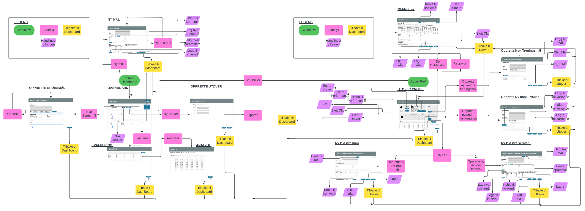

#### Legend

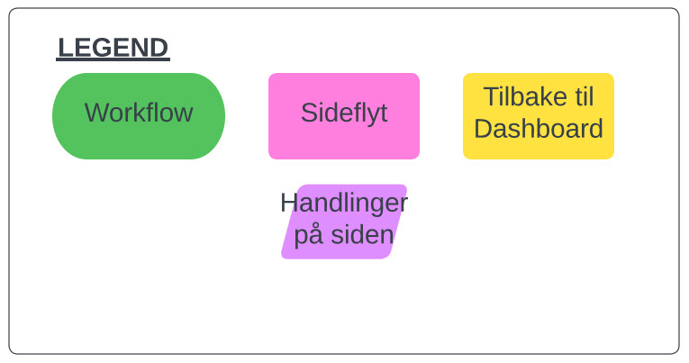

#### Dashboard (main page /)

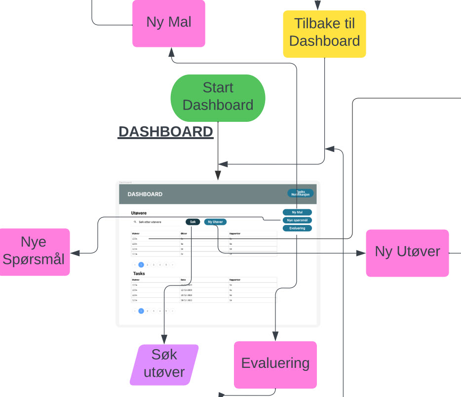

#### Analyse (analysis)

- Denne er i utviklingsfasen flyttet til å være på Utøver Profil

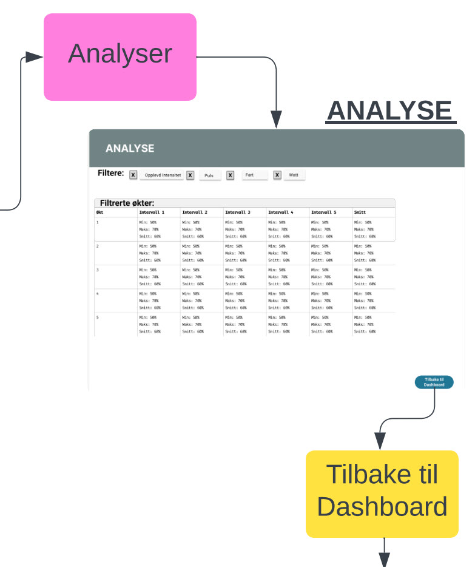

#### Evaluering (evaluation)

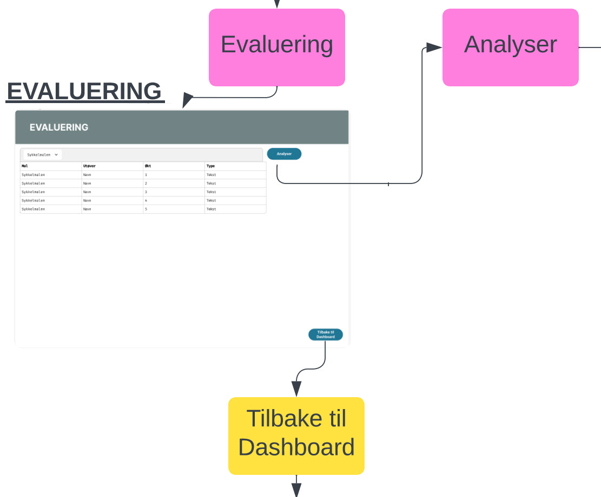

#### Opprette ny utøver (new_athlete)

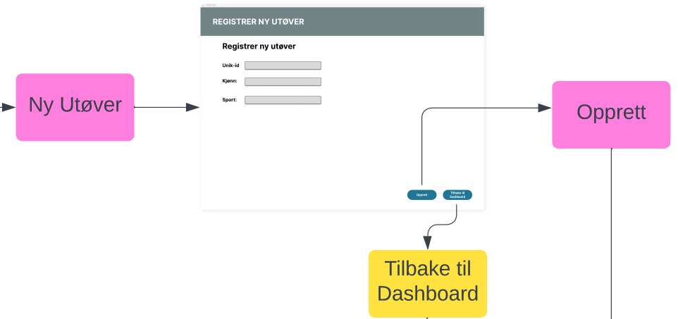

#### Opprette nye spørsmål (new_questions)

#### Opprette ny mal (new_template)

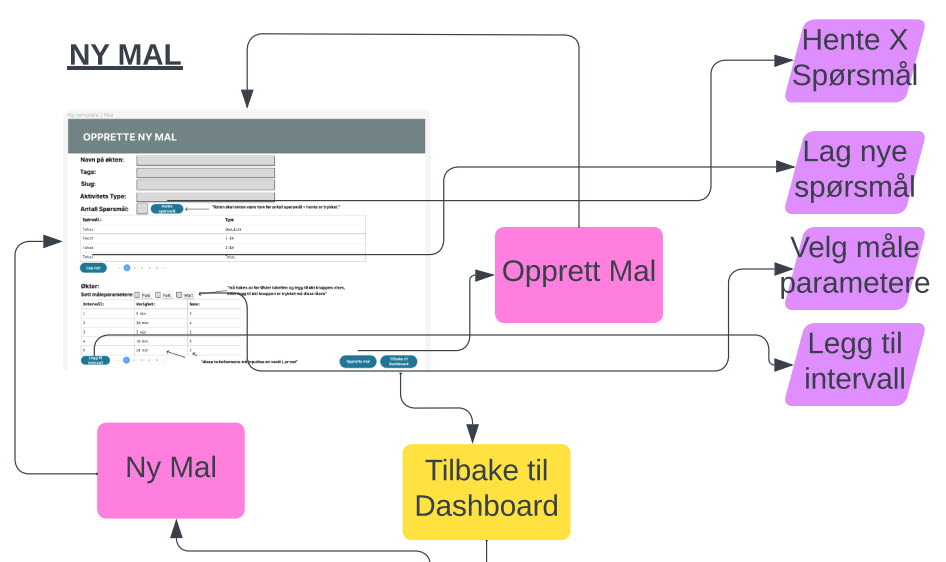

#### Utøver Profil (athlete/[userId])

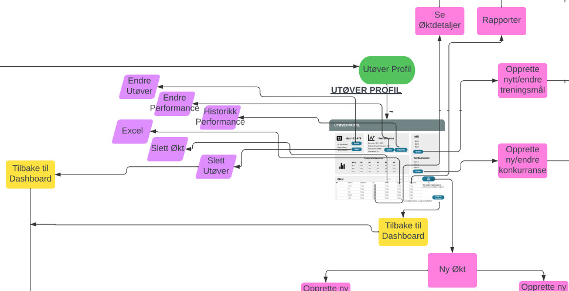

#### Økt Detaljer (workout/[workoutId])

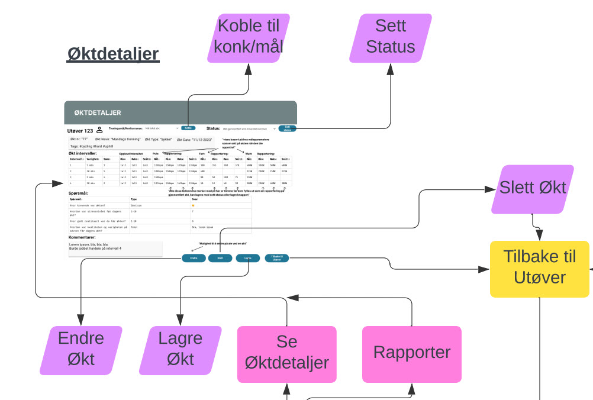

#### Opprette ny Økt (new_workout/[userId])

- Opprette ny Økt fra Scratch (NewWorkoutScratch)

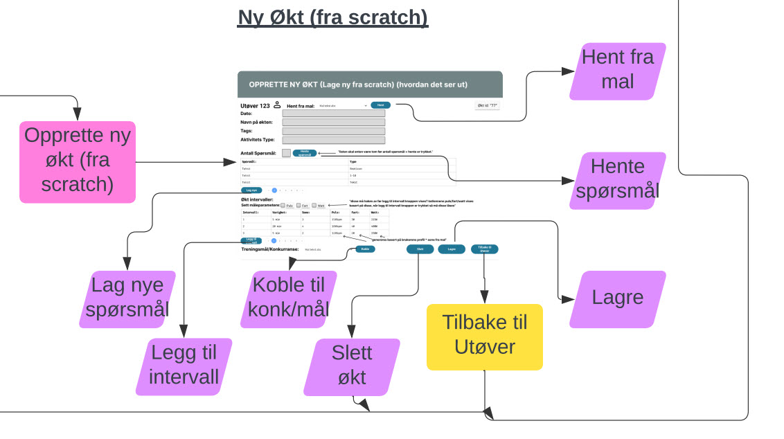

- Opprette ny Økt fra Mal (NewWorkoutTemplate)

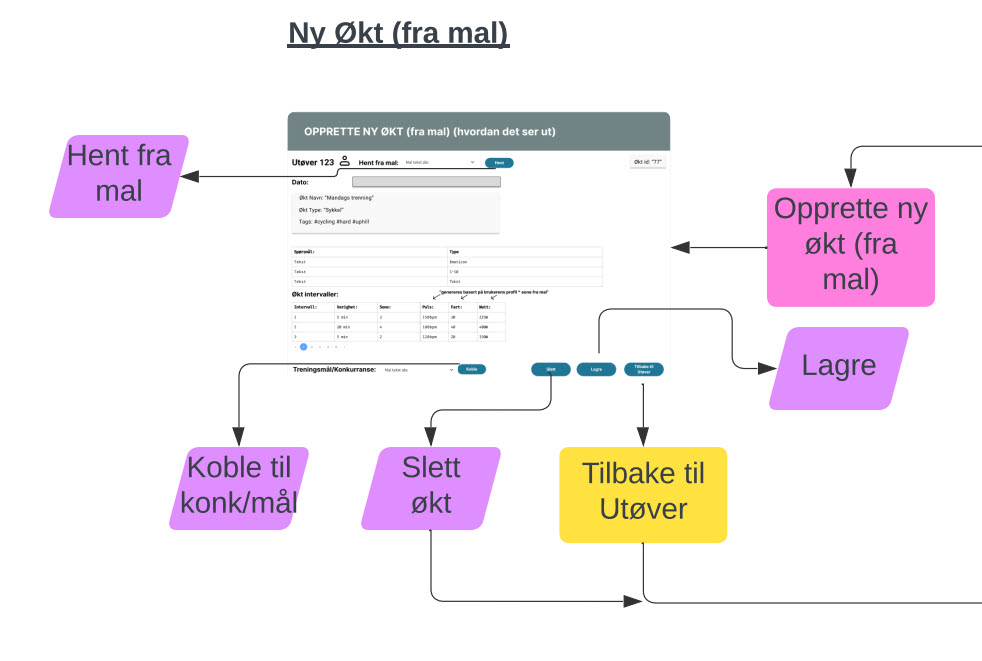

#### Opprette ny Konkurranse (new_tournament/[userId])

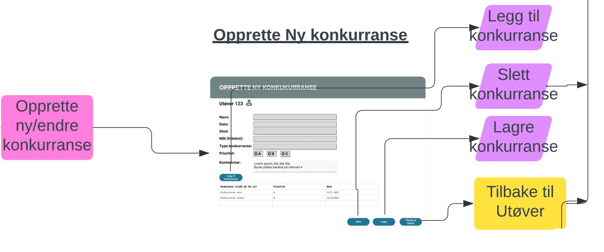

#### Opprette nytt Treningsmål (new_goald/[userId])

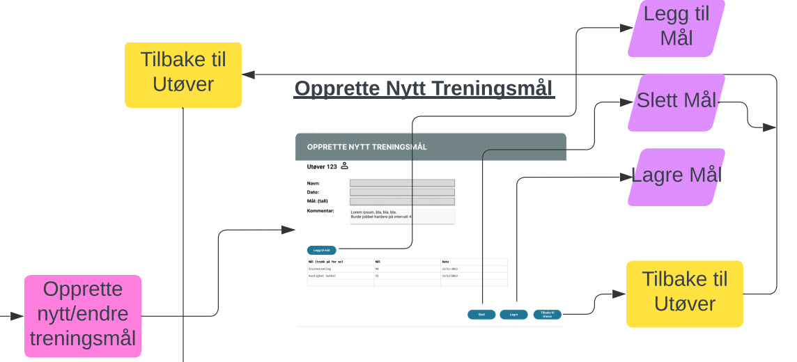

---
